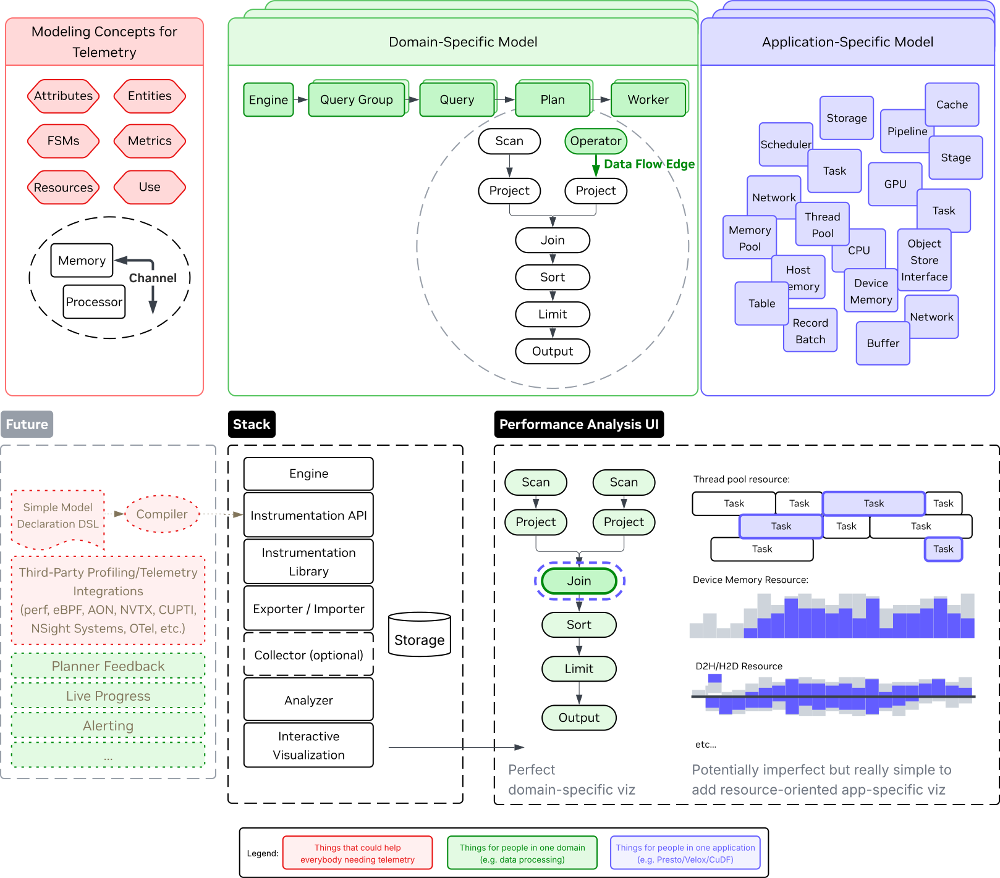

# Quent: QUery ENgine Telemetry

(working title)

Reduce the time-to-conclusion of performance analysis of query engines found in
data processing.

## TL;DR

- A **generic model of query engines** provides a **semantic layer** over
  traditional telemetry (traces, logs, metrics) and specifies more concepts
  (FSMs and resources).
- The model supports **distributed engines** that use
  **non-CPU based computation** and has explicit constructs for all types of
  resources (including memory, i/o), not just compute.
- Libraries with an **Instrumentation API** target typical languages used to
  build query engines (Rust, C++, Java, Python) to capture telemetry according
  to the model.
- A toolchain for **analysis and exploration** of engine performance is provided
  to **reduce the time-to-conclusion** of engine devleopers, engine users and
  system architects iterating on performance. The generic model also helps
  **compare engines and systems**.
- The implementation aims to be nimble enough to allow it being **always on**.

## Why

Understanding performance of (distributed) query engines running on advanced
hardware (e.g. with GPUs using GPUDirect RDMA technologies) is hard and
therefore takes a lot of time.

Engine developers may spend countless hours
reproducing regressions seen in obscure CI systems running in the cloud with
profiling tools attached, and then having to relate stack traces that go through
asynchronous execution libraries or compute layers such as CUDF to abstractions
they know from the code that they own. Not to mention countless of hours spent
writing brittle log analysis scripts that break the second someone makes a
commit to refactor a small portion of the code.

It cannot be expected that a typical data analyst fully understands e.g. a
`perf` or NSight Systems profile of an engine that they didn't design. How are
they going to relate anything they see back to their query, their interface into
this engine? It will take a lot of knowledge of the internals and a lot of
effort. Their willingness to use an engine (or a GPU-accelerated variant
thereof) may fall or stand with their ability to easily identify and solve
performance issues.

The time-to-conclusion of performance analysis efforts is therefore
typically large - in the order of hours to days. This needs to become seconds or
minutes instead.

## Who

This project is useful for:

- A) engine developers - when optimizing performance, implementing new features,
  or investigating regressions
- B) engine users - to quickly understand the bottlenecks in their queries
  running on specific engines and systems, in order to rewrite queries or pick a
  better system configuration
- C) system architects - to compare the integration of generic components across
  different engines and systems

## How

From a distance, the execution of queries in query engines goes through three
layers:

1. Planning - a query is transformed into a plan (which can go through multiple
   levels of planning) in the form of a Directed Acyclic Graph (DAG) that
   represents a dataflow graph.
2. Orchestration - the query is executed through various abstractions that
   manage I/O, computation and memory resources, as well as communication in
   distributed engines. These abstractions make it easier to build query
   engines. Examples include control flow through asynchronous executors,
   execution on non-CPU computational devices such as GPUs, spill memory to
   storage automatically in out-of-memory scenarios, and interfaces that
   simplify reading from myriad storage interfaces, including cloud-based object
   stores OS-based file systems, or DMA-capable storage systems.

3. Hardware - the abstractions ultimately perform work on hardware including:
   - Loading data from storage devices
   - Storing intermediate results in GPU devive memory
   - Moving data over PCIe interfaces
   - Performing computations on CPU or GPU cores

Provided that concepts present at each layer can be generelized (e.g. in layer
1: a DAG, in layer 2: a memory pool, in layer 3: a storage interface), we can
also generalize performance analysis thereof and construct a generic query
engine model.

By performing measurements / capturing telemetry of a query engine accords with
the rules of such a generic model, one analysis tool can be provided that
quickly answers questions typically asked by users A, B, and C (described in the
previous section), that works for multiple engines. These questions include:

- When running the same query after a commit with a regression, what is the
  source of the regression?
- How does new feature X for operator Y affect the performance characteristics
  of other operators?
- Which DAG operator's outputs were most spilled over the PCIe interface, when
  and why?
- Which operator causes most pressure on the host memory pool, when and why?
- TODO: gather more examples

## What

This project provides three things:

1. A specification of the generic query engine model.
2. A set of libraries with an Instrumentation API capable of capturing query
   engine telemetry according to the rules of the model.
3. An implementation of an analysis system with an intuitive user interface that
   provides low time-to-conclusion to common questions for users of type A, B
   and C.

### Model

Quent provides a query engine model onto which engine implementers map
the constructs of their engine.

The model aims to be generic enough such that it
supports various execution paradigms, including but not limited to:

- local and distributed execution
- sequential and concurrent query execution
- engines operating on asynchronous runtimes
- engines running on heterogeneous systems with non-CPU based compute

For more details, please refer to the model specification:
[model.md](./model.md)

### Technology stack



Quent consists of various composable components, according to the following
layers:

1. **Engine**: the (distributed) query engine to be profiled. Anything for which
   the top-level query can be expressed as a data-flow system processing a
   Directed Acyclic Graph (DAG) is a potential candidate.
2. **Instrumentation**: libraries used by target engines to produce telemetry
   events in the engine's native language.
   - The API provided by such a library will be used by engine developers to
     instrument their engine.
   - Typically wraps around a thin efficient minimal-latency Rust-based layer
     which orchestrastes exporting events.
   - May (but not required to) perform (partial) model validation.
   - Implementations live in [instrumentation/](instrumentation/).
3. **Exporter**: provides the means to export telemetry events captured by the
   instrumentation library.
   - Exporter implementations would typically exist to export telemetry events
     in arbitrary ways.
   - Examples include: a local log file, layered on top of OpenTelemetry logs,
     as Parquet files to a cloud-based object store, or to a database.
   - One exporter will be a collector-exporter, which sends telemetry to a
     centralized collector, see below.
   - Implementations live in [crates/exporter/](crates/exporter).
4. **(Collector)**: service that collects telemetry events into a single process
   and exports them using arbitrary exporters.
   - This is optional because a scalable system may choose to export everything
     in a decentralized manner for performance reasons.
   - A less obvious argument for making this optional is that in typical
     use-cases like continuous benchmarking and production, MOST telemetry is
     never accessed, especially if no performance anomalies occur. Therefore,
     spending cycles on collection can be very wasteful if it can be lazily
     retrieved afterwards instead.

   - Implementations live in [crates/collector/](crates/collector).

5. **Analyzer**: service that reads raw events, validates the model, and
   performs useful aggregations of bulk events used in visualization.
   - The reference implementation lives in [crates/analyzer/](crates/analyzer).
6. **Web Server**: service that interacts with the analyzer and performs final
   data wrangling for UI interactions.
   - The reference implementation lives in [webserver/](webserver).
7. **User Interface**: application facing developers and data engineers using
   the query engine, helps to quickly gain performance insights about queries.

## Running the Quent Server & Simulator

### Docker Compose (recommended)

#### Requirements

- Docker + Docker Compose (or [Podman](https://podman.io/) + [Podman Compose](https://docs.podman.io/en/v5.6.2/markdown/podman-compose.1.html))

#### Steps

Assuming you are running this from the repo root, this will spawn a server and
run the simulator to spam some events at the server. For now :tm:, the server
will store event data in `./data` in `<engine id>.ndjson` format.

- 1. Build the images:

```bash
docker compose build
```

- 2. Spawn the containers:

```bash
docker compose up
```

- 3. Use the server, e.g.:

```bash
curl http://localhost:8080/analyzer/list_engines -H "Accept: application/json"
```

This should return a list of valid engine UUIDs:

```text
["019ae957-6af3-71a3-b7a9-5b351a83a2b1"]%
```

- 4. Shut everything down:

```bash
docker compose down
```

For quickly iterating, you can merge step 1 + 2 using
`docker compose up --build`.

## Analyzer Service API

The Analyzer Service (which for now :tm: runs as part of the `quent-server`
executable) provides HTTP endpoints that trigger analysis of raw event files and
delivers information that is validated and easy-to-digest (as in small enough
for snappy interactions through web technologies).

Typically, interactions with the Analyzer start by listing engines it knows, by
hitting: `/analyzer/engine/list`, which returns a JSON array with strings that
represent engine UUIDs.

From there, various other HTTP endpoints (will) exist to continue to explore the
profile of a query engine. (For now this can be figured out from a very nasty
looking [source file](crates/server/src/main.rs) but I will clean this up soon
:tm:).

Type definitions for `application/JSON` type data delivered by those routes can
be generated by running:

```text
cargo build -p quent-server
```

For now, these are checked in to the repository under [this folder](crates/server/bindings).

### Example

After obtaining an engine ID, like so:

```text
curl http://localhost:8080/analyzer/list_engines -H "Accept: application/json"
["019aee29-42a6-79b3-be5f-903f041b4e95"]%
```

one may hit the endpoint providing high-level information about an engine:

```text
curl http://localhost:8080/analyzer/engine/019aee29-42a6-79b3-be5f-903f041b4e95 -H "Accept: application/json"
{"id":"019aee29-42a6-79b3-be5f-903f041b4e95","timestamps":{"init":1764932277849433000,"operating":1764932277849439000,"finalizing":1764932277850016000,"exit":1764932277850022000}}%
```

and then continue down to find all query groups of said engine:

```text
curl http://localhost:8080/analyzer/engine/019aee29-42a6-79b3-be5f-903f041b4e95/list_query_groups -H "Accept: application/json"
["019aee29-5659-7f81-80e9-924b55dd3756","019aee29-5659-7f81-80e9-925e254fb669"]%
```

and then continue down to find all queries of said engine:

```text
curl http://localhost:8080/analyzer/engine/019aee29-42a6-79b3-be5f-903f041b4e95/query_group/019aee29-5659-7f81-80e9-924b55dd3756/list_queries -H "Accept: application/json"
["019aee29-5659-7f81-80e9-924b55dd3756","019aee29-5659-7f81-80e9-925e254fb669"]%
```

and finally arrive at a query:

```text
curl http://localhost:8080/analyzer/engine/019aee29-42a6-79b3-be5f-903f041b4e95/query/019aee29-5659-7f81-80e9-9271ce782180 -H "Accept: application/json"
{"id":"019aee29-5659-7f81-80e9-9271ce782180","query_group_id":"019aee29-5659-7f81-80e9-924b55dd3756","timestamps":{"init":1764932277849695000,"planning":1764932277849696000,"executing":1764932277849697000,"idle":1764932277849697000,"finalizing":1764932277849697000,"exit":1764932277849697000}}%
```

... and so forth.

This JSON object matches the definition of the `Engine` type in
[this generated source](crates/server/bindings/Engine.ts).

N.B. that the above is a latency-sensitive pattern that will end at some point.
This going back-and-forth with the analyzer is only necessary at these higher
levels because Engines and Coordinators are assumed to be able to run for very
long periods of time. Eventually we want to paginate these endpoints.

When using the simulator as a telemetry source, it will emit handy links that
should work when using the Docker Compose setup described above to quickly
obtain JSON data from Analyzer endpoints.
