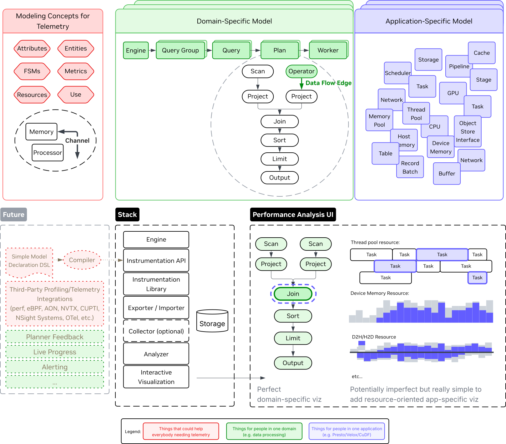
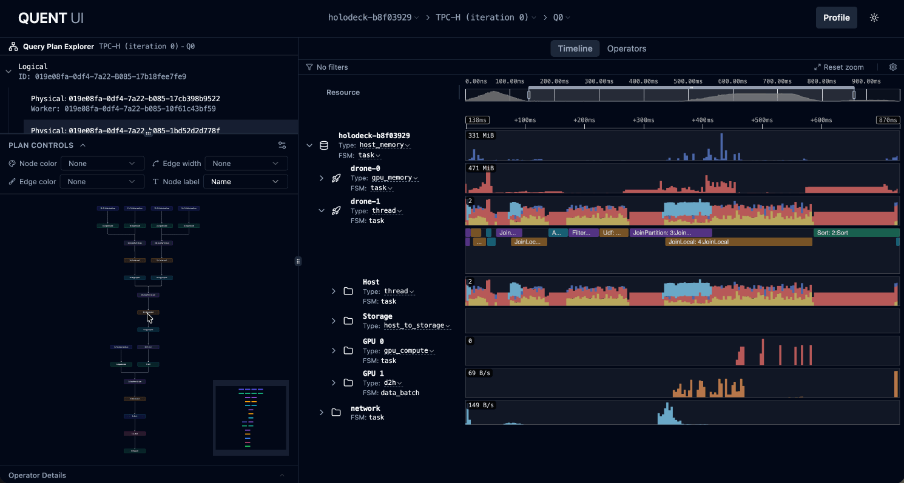

<!-- rumdl-disable MD033 MD041 -->

<h1 align="center">
  
  Quent
</h1>

<p align="center">
  <a href="https://github.com/rapidsai/quent/actions/workflows/rust.yml"></a>
  <a href="https://github.com/rapidsai/quent/actions/workflows/python.yml"></a>
  <a href="https://github.com/rapidsai/quent/actions/workflows/cpp.yml"></a>
  <a href="https://github.com/rapidsai/quent/actions/workflows/ui.yml"></a>
  <a href="LICENSE"></a>
</p>

<p align="center">
  <a href="https://rapidsai.github.io/quent/simulator/#/profile/engine/01a07b4c-86ab-7971-97c1-24879c41910e/query/01a07b4c-86ab-7971-97c1-28ffb10dde0d/timeline">Try the query engine UI</a>
  &bull;
  <a href="https://rapidsai.github.io/quent/schema/">Schema Explorer</a>
  &bull;
  <a href="https://rapidsai.github.io/quent/tutorial/">Tutorial</a>
</p>

Quent helps build dedicated performance analysis tools tailored to your
application. You and your agents first define a _schema_ of _events_ with
_attributes_ emitted from your data and control flow abstractions (called
_entities_) at runtime.

Quent then turns the _schema_ into a dedicated _instrumentation library_. This
instrumentation library not only has a type-safe API but also uses a statically
typed export path for maximum performance.

The intended architecture also includes a statically typed _analysis library_
generated from the schema. This library is a work in progress and is not
currently available. It will support querying stored events by attribute values
and enriching those events with semantics provided by what we call _semantic
modules_.

<p align="center">

</p>

[Semantic modules](#semantic-modules) are curated vertical slices of Quent’s
stack. Each semantic module can contribute semantics around basic schema
elements (e.g. on events or attributes), and potentially add support for those
semantics in instrumentation or analysis code generation. Semantic modules can
also include curated visualizations for user interfaces, querying events through
CLIs or MCP endpoints to support agent-in-the-loop optimization efforts, and
more.

Quent is currently developed around the use case of accelerated data-processing
engines. An elaborate example of how Quent is used to produce a domain-specific
analysis toolchain with a user interface in this domain is shown below:



## Try it

To quickly get an idea of what the framework can do, open the
[live query-engine profiler UI](https://rapidsai.github.io/quent/simulator/#/profile/engine/01a07b4c-86ab-7971-97c1-24879c41910e/query/01a07b4c-86ab-7971-97c1-28ffb10dde0d/timeline).
It runs a simulated query-engine workload entirely in your browser and requires
no installation.

This simulator is one example of a performance-analysis application built with
Quent; it targets the query-engine domain. To run it locally, install
[Docker](https://docs.docker.com/compose/install/) with the Compose plugin, then
start the complete example from the repository root:

```bash
docker compose -f experimental/vibe/simulator/docker-compose.yml up --build
```

Open the
[simulated query timeline](http://localhost:8080/profile/engine/01a07b4c-86ab-7971-97c1-24879c41910e/query/01a07b4c-86ab-7971-97c1-28ffb10dde0d/timeline)
after the services start. Docker Compose serves the UI and analysis API, and
runs the simulator once to generate a sample query-engine dataset. Press
`Ctrl+C` to stop the stack.

For frontend development with Vite and hot reload, see the
[development guide](DEVELOPMENT.md#run-the-ui-development-server).

### Explore the modeling approach

The hosted
[Quent Schema Explorer](https://rapidsai.github.io/quent/schema/)
is a browser-based YAML schema editor and visualization tool. Use it to edit
example schemas and explore how Quent models entities, events, finite-state
machines, resources, and their relationships without installing anything.

## Why

Quent is built to address a growing complexity gap between complex modern
accelerated and distributed systems software and low-level profiling tools.

Highly dynamic software systems (take query engines, for example) have a lot of
"stuff" to do before the heavy computation actually starts inside accelerators.
All that "stuff" is complex, highly layered, and very custom-tailored. This may
include asynchronous execution engines, multi-layered workload schedulers,
out-of-core execution support, caching, and much more. All these things need to
exist before considering the computational kernels executed on accelerators. At
the same time, this software must not bottleneck the raw computational and I/O
performance that accelerated
systems nowadays provide. Looking at all this abstract machinery with
traditional profiling tools is, however, both hard and time-consuming, since
these tools provide incredibly detailed call-stack traces that add a lot of
noise, greatly inflate storage requirements, and typically do not "speak the
same language" as the abstractions in the system's software architecture.

The goal of profiling tools built with Quent is to reduce time to conclusion
(TTC) for these applications by allowing developers to start performance
analysis from code they work with every day, have full control over, and have
already formed mental models for. This helps narrow the analysis first in a
familiar environment before reaching for other excellent low-level profiling
tools such as Linux Perf, NVIDIA Nsight Systems or Nsight Compute for deeper
system-level or closer-to-hardware analysis.

## Status

Quent is an experimental alpha-stage project and is changing quickly. It is
currently migrating from a PoC to a first beta release. Schema format, generated
APIs, runtime, analysis components, and documentation may change without
compatibility guarantees for now. There are no releases yet. Breaking changes
and bugs are currently expected. Use this at your own risk.

At the same time, Quent is already used or being evaluated in pioneering engines
such as the GPU-accelerated [SiriusDB](https://www.sirius-db.com/) and [cuDF
Polars](https://docs.rapids.ai/api/cudf/stable/cudf_polars/).

## Semantic modules

Semantic modules are already composable parts of Quent's architecture and the
primary mechanism by which the framework intends to evolve features. New
semantic modules can expand its capabilities without requiring corresponding
changes to the core framework or breaking existing module compositions.

Quent assumes coding agents will become a common way to assemble
application-specific tooling. For now, this avoids the need for elaborate
extension mechanisms that encode every possible composition. Developers can
provide ordinary glue code, either directly or with an agent, to combine
semantic modules into a dedicated performance analysis tool.

Using an agent is optional. The same interfaces and artifacts are intended to
remain understandable, reviewable, and usable by developers working without
one. Semantic modules keep this flexible composition coherent. Each module
defines specific telemetry concepts and rules. Its associated instrumentation,
analysis, and visualization components use those same definitions. The intended
architecture preserves these definitions through end-to-end static typing, from
the schema to generated instrumentation and analysis code. Invalid uses can then
be rejected early, giving both developers and agents consistent constraints
throughout the stack.

The repository currently includes semantic modules useful across a wide variety
of applications.

- [`quent-fsm`](crates/fsm/): describes the potential sequences of events by
  modeling entities as finite-state machines.
  - Through this semantic module, the instrumentation library can be generated
    such that invalid transitions are already rejected at compile time, and/or
    an analysis library can validate whether FSM transition events followed the
    described topology.
- [`quent-resource`](crates/resource/): defines resources such as memories,
  channels, and processing elements, and how other entities can use them.
  - Through this semantic module, an analysis library can provide functionality
    that checks whether resources were saturated above some threshold for a
    certain duration, or it can generate data for a resource utilization
    timeline visualization.
- [`quent-ref-target`](crates/ref-target/): constrains references to other
  entities to be of a certain type.
- [`quent-ref-tree`](crates/ref-tree/): allows forming hierarchies of
  event-emitting entities to, e.g., provide the canonical path of performance
  analysis exploration through all event data from a UI.

Semantic modules can address application- or domain-specific concerns. For
example, applications like query engines often capture their computational path
via directed acyclic graphs. By capturing rules for how a schema should
represent vertices and edges, and how data flow across edges can be captured,
an analysis component can quickly find all associated events, and a UI component
can visually render the graph and data flowing across edges over time as shown
in the example above.

Quent does not currently provide a mechanism for plugging third-party semantic
modules yet. A plugin mechanism may allow externally authored semantic modules
in the future.

## Quick example

### Schema definition

At the surface, writing a Quent schema is similar to defining attributes of
structured logs. While it can do so, it is a bit more than that. A Quent schema
is said to capture the "application event model" because, it tells you what
events exist and, especially by leveraging semantic modules, you model the
(expected) behavior of entities in your application at the event/attribute
level.

Examples of entities include an object whose lifecycle you want to track, a span
of code of a function that you want to time, an asynchronous task traveling
through its executor, a memory pool dealing out allocations, basically anything
that you could emit some useful event for.

Quent's YAML-based source format is one way to capture your application event
model:

```yaml
quent: alpha # Version of Quent's YAML-based DSL
model: Hello # Name of the model

entities:
  # Model the entire program as an entity.
  App:
    events:
      # We want to know when the program started ...
      started:
        attributes:
          # ... and what its arguments were
          args: { list: string }
```

### Generating an instrumentation library

After you finish modeling your application's events, a
[Cargo build script](crates/instrumentation-build/example/build.rs) can use
`quent-yaml` to parse and validate a YAML source before
`quent-instrumentation-build` generates a typed Rust instrumentation library in
Cargo's `OUT_DIR`.

While Quent's core (generated) libraries are written in Rust, please see the
[cross-language integration section](#cross-language-integration) for how to
generate Python or C++ wrappers.

### Instrumenting an application

After generating the instrumentation library, include the generated source and
emit the schema's events:

```rust
// Include the generated code
include!(concat!(env!("OUT_DIR"), "/hello.rs"));

// Spawn a context (named after the model, see YAML) with a runtime for event
// exporting:
let context = HelloContext::try_new(None)?;

// Every entity type gets its own export pipeline, called an "observer":
let obs = context.app_observer();

// Every entity instance has an associated handle dealt out by the observer:
let app = obs.handle();

// Emit an event.
app.started(std::env::args().collect())?;
```

### Applying semantic modules

Semantic modules can apply sets of rules to schemas that add guarantees and
specialized semantics. This ultimately helps ensure that events can be properly
interpreted during analysis and that the outcome can be properly visualized (or
otherwise utilized).

Quent's YAML-based source format provides syntactic sugar for applying semantic
modules to a schema. It currently covers typed references, hierarchical scoped
references, FSMs, and resources with capacities, bounds, and usages. For
example, every FSM has exactly one initial state, every transition target must
be declared, and a state with no `to` transitions is final:

```yaml
quent: alpha
model: hello

fsms:
  App:
    states:
      started:
        initial: true
        to: [ended]
      ended:
        attributes:
          success: bool
```

## Cross-language integration

Quent generates one canonical Rust instrumentation library. When needed,
additional code generators can provide bindings over that implementation. This
keeps event behavior and exporter integration consistent across languages
without maintaining separate language-specific SDKs. The experimental
generators currently support C++ and Python:

- [`quent-schema-codegen-cpp`](experimental/vibe/codegen/cpp/) generates C++
  bindings with CXX.
- [`quent-schema-codegen-python`](experimental/vibe/codegen/python/) generates
  Python bindings and type stubs with PyO3.

## More information

- [Complete schema-based instrumentation example](crates/instrumentation-build/example/)
- [Development guide](DEVELOPMENT.md)
- [Contributing guide](CONTRIBUTING.md)

## Roadmap

- Schema capture
  - [x] YAML-based DSL
- Code generation
  - [x] Instrumentation library
    - [x] FSM typestate pattern API
    - [x] Python integration
      - [ ] Packaging
        - [ ] Wheels
        - [ ] Conda
    - [x] C++ integration
      - [ ] Packaging
        - [ ] CMake
        - [ ] Conda
        - ...
  - [ ] Analysis library
    - [ ] Dataframe-style query API
    - [ ] Lazy evaluation
    - [ ] Async
    - [ ] Query engine backend
  - [ ] Command-Line Interface
  - [ ] Reusable GitHub Actions Workflow
- Exporters
  - [x] NDJSON
  - [x] Postcard
  - [x] MessagePack
  - [x] gRPC Collector
  - [ ] Parquet
  - [ ] DuckDB
  - [ ] DuckDB Quack
  - ...
- Semantic modules
  - [x] Typed and scoped references
  - [x] Finite-State-Machines
    - UI
      - [x] Transitions Viewer
  - [x] Resource
    - UI
      - [x] Timeline
  - [ ] Directed Acyclic Graph
    - UI
      - [x] Viewer
      - [x] Node stati~~stics
  - [ ] OS Process + Thread
  - [x] NVTX
    - [x] UI Range Viewer
  - [ ] CUPTI
- UI
  - [x] Entity listing and filtering
  - [ ] Blueprints
- [ ] Model Context Protocol
- Tutorials
  - Instrumentation
    - [x] Rust
    - [x] C++
    - [x] Python
  - [ ] Analysis
