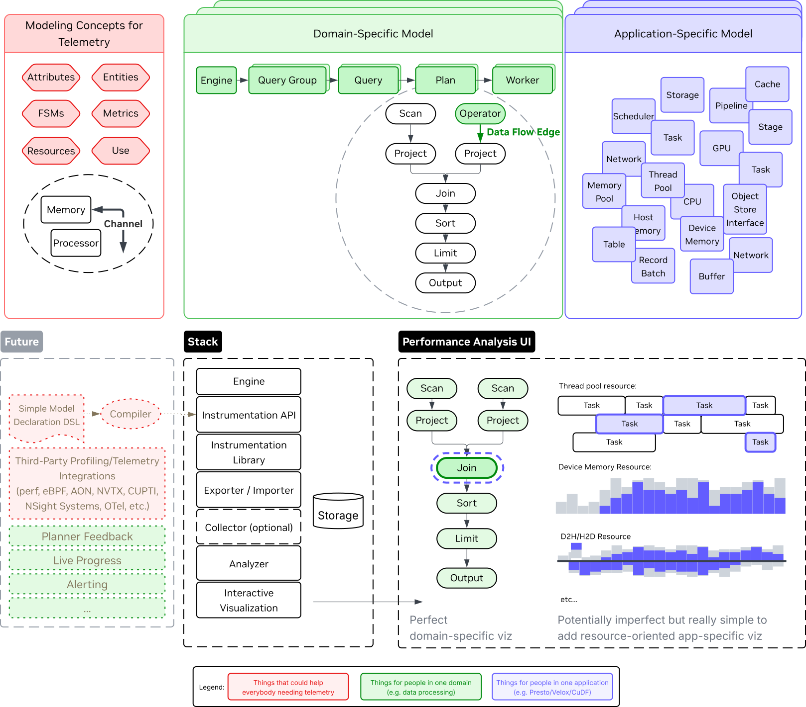
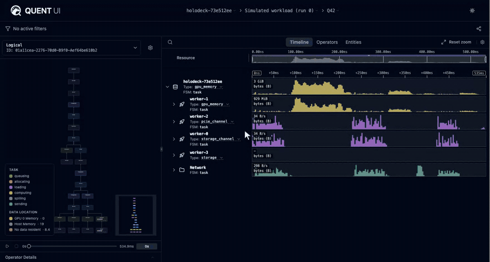

<!-- rumdl-disable MD033 MD041 -->

<h1 align="center">
  
  Quent
</h1>

<p align="center">
  <a href="https://github.com/rapidsai/quent/actions/workflows/rust.yml"></a>
  <a href="https://github.com/rapidsai/quent/actions/workflows/python.yml"></a>
  <a href="https://github.com/rapidsai/quent/actions/workflows/cpp.yml"></a>
  <a href="https://github.com/rapidsai/quent/actions/workflows/ui.yml"></a>
  <a href="LICENSE"></a>
</p>

<p align="center">
  <a href="https://rapidsai.github.io/quent/simulator/#/profile/engine/01a07b4c-86ab-7971-97c1-24879c41910e/query/01a07b4c-86ab-7971-97c1-28ffb10dde0d/timeline">Try the query engine UI</a>
  &bull;
  <a href="https://rapidsai.github.io/quent/schema/">Schema Explorer</a>
  &bull;
  <a href="https://rapidsai.github.io/quent/tutorial/">Tutorial</a>
</p>

Quent helps build dedicated performance analysis tools tailored to your
application in order to reduce the time it takes you to arrive to conclusions
about performance.

You first define a _schema_ of _events_ and their _attributes_ describing the
things you want to observe (called _entities_) at runtime.

Quent then turns the _schema_ into a dedicated low-latency _instrumentation
library_. This instrumentation library has a type-safe API and a statically
typed export path for maximum performance.

Quent also turns the _schema_ into a statically typed _analysis library_
([WIP](https://github.com/rapidsai/quent/issues/516)).
It will support querying stored events while enriching those events with
semantics provided by what we call _semantic modules_ (see below).

Quent's schema-centric approach aims to ensure that across the entire
performance analysis stack, all the way from the instrumentation side down to
analysis and visualization, everything stays in sync. This provides extensive
guardrails for humans and agents to build application-specific performance
analysis tools. No more event definitions drifting between producers and
consumers. No more instrumentation changes silently breaking analysis. No more
tools interpreting the same events differently.

<p align="center">

</p>

[Semantic modules](#semantic-modules) are curated vertical slices of Quent’s
stack. Each semantic module can contribute semantics around basic schema
elements (i.e. entities, events, and their attributes), and potentially add
additional support for those semantics in instrumentation or analysis code
generation. This helps provide more guardrails during instrumentation or
analysis. Semantic modules can also include visualizations for user interfaces,
querying events through CLIs or MCP endpoints to support agent-in-the-loop
optimization efforts, and more.

Quent is currently developed around the use case of accelerated data-processing
engines. An elaborate example of how Quent is used to produce a domain-specific
analysis toolchain with a user interface in this domain is shown below:



## Try it

To quickly get an idea of what the framework can do, open the
[live query-engine performance analysis UI](https://rapidsai.github.io/quent/simulator/#/profile/engine/01a07b4c-86ab-7971-97c1-24879c41910e/query/01a07b4c-86ab-7971-97c1-28ffb10dde0d/timeline).
It runs a simulated query-engine workload entirely in your browser and requires
no installation.

This simulator is one example of a performance-analysis application built with
Quent; it targets the query-engine domain. To run it locally, install
[Docker](https://docs.docker.com/compose/install/) with the Compose plugin, then
start the complete example from the repository root:

```bash
docker compose -f experimental/vibe/simulator/docker-compose.yml up --build
```

Open the
[simulated query timeline](http://localhost:8080/profile/engine/01a07b4c-86ab-7971-97c1-24879c41910e/query/01a07b4c-86ab-7971-97c1-28ffb10dde0d/timeline)
after the services start. Docker Compose serves the UI and analysis API, and
runs the simulator once to generate a sample query-engine dataset. Press
`Ctrl+C` to stop the stack.

For frontend development with Vite and hot reload, see the
[development guide](DEVELOPMENT.md#run-the-ui-development-server).

### Explore the modeling approach

The hosted
[Quent Schema Explorer](https://rapidsai.github.io/quent/schema/)
is a browser-based YAML schema editor and visualization tool. Use it to edit
example schemas and explore how Quent models entities, events, finite-state
machines, resources, and their relationships without installing anything.

## Status

Quent is an experimental alpha-stage project and is changing quickly. It is
currently migrating from a PoC to a first beta release. Schema format, generated
APIs, runtime, analysis components, and documentation may change without
compatibility guarantees for now. There are no releases yet. Breaking changes
and bugs are currently expected. Use this at your own risk.

At the same time, Quent is already used or being evaluated in pioneering engines
such as the GPU-accelerated [SiriusDB](https://www.sirius-db.com/) and [cuDF
Polars](https://docs.rapids.ai/api/cudf/stable/cudf_polars/).

## Semantic modules

Semantic modules provide composable parts that you can add to the performance
analysis tool you're building with Quent. Each module defines specific telemetry
concepts and rules. Its associated instrumentation, analysis, and visualization
components use those same definitions. The goal is for generated instrumentation
and analysis code to use the same schema-defined types and enforce the same
semantic rules. Invalid uses can then be rejected early, giving both developers
and agents consistent constraints throughout the stack.

The repository includes these general-purpose semantic modules:

- [`quent-fsm`](crates/fsm/): models valid event sequences as finite-state
  machines, supporting compile-time transition checks and analysis-time
  validation.
- [`quent-resource`](crates/resource/): models resources such as memories,
  channels, and processing elements, and their usage by entities. Supports
  utilization timelines and checks for saturation above a threshold for a
  specified duration.
- [`quent-log`](crates/log/): defines entity-scoped logging sinks with ordered
  severity levels and arbitrary event attributes.
- [`quent-ref-target`](crates/ref-target/): restricts entity references to a
  specified entity type.
- [`quent-ref-tree`](crates/ref-tree/): defines entity hierarchies that provide
  a canonical path for exploring related events.
- [`quent-os`](crates/os/): identifies entities as operating-system processes
  and threads for correlation with external event streams.

Modules can also address domain-specific concerns. For example, a query-engine
module can define how a schema represents a directed acyclic graph and data flow
across its edges, enabling analysis to locate associated events and a UI to
visualize data flow over time.

Quent does not currently support third-party semantic module plugins, but this
may become a feature in the future.

## Quick example

For C++ and Python examples, see the
[tutorial](https://rapidsai.github.io/quent/tutorial/).

### Schema definition

At the surface, writing a Quent schema is similar to defining attributes of
structured logs. While it can do so, it is a bit more than that. A Quent schema
is said to capture the "application event model" because, it tells you what
events exist and, especially by leveraging semantic modules, you model the
(expected) behavior of entities in your application at the event/attribute
level.

Examples of entities include an object whose lifecycle you want to track, a span
of code of a function that you want to time, an asynchronous task traveling
through its executor, a memory pool dealing out allocations, basically anything
that you could emit some useful event for.

Quent's YAML-based source format is one way to capture your application event
model:

```yaml
quent: alpha # Version of Quent's YAML-based DSL
model: Hello # Name of the model

entities:
  # Model the entire program as an entity.
  App:
    events:
      # We want to know when the program started ...
      started:
        attributes:
          # ... and what its arguments were
          args: { list: string }
```

### Generating an instrumentation library

After you finish modeling your application's events, a
[Cargo build script](crates/instrumentation-build/example/build.rs) can use
`quent-yaml` to parse and validate a YAML source before
`quent-instrumentation-build` generates a typed Rust instrumentation library in
Cargo's `OUT_DIR`.

While Quent's core (generated) libraries are written in Rust, please see the
[cross-language integration section](#cross-language-integration) for how to
generate Python or C++ wrappers.

### Instrumenting an application

After generating the instrumentation library, include the generated source and
emit the schema's events:

```rust
// Include the generated code
include!(concat!(env!("OUT_DIR"), "/hello.rs"));

// Spawn a context (named after the model, see YAML) with a runtime for event
// exporting:
let context = HelloContext::try_new(None)?;

// Every entity type gets its own export pipeline, called an "observer":
let obs = context.app_observer();

// Every entity instance has an associated handle dealt out by the observer:
let app = obs.handle();

// Emit an event.
app.started(std::env::args().collect())?;
```

### Applying semantic modules

Semantic modules can apply sets of rules to schemas that add guarantees and
specialized semantics. This ultimately helps ensure that events can be properly
interpreted during analysis and that the outcome can be properly visualized (or
otherwise utilized).

Quent's YAML-based source format provides syntactic sugar for applying semantic
modules to a schema. It currently covers typed references, hierarchical scoped
references, FSMs, and resources with capacities, bounds, and usages. For
example, every FSM has exactly one initial state, every transition target must
be declared, and a state with no `to` transitions is final:

```yaml
quent: alpha
model: hello

fsms:
  App:
    states:
      started:
        initial: true
        to: [ended]
      ended:
        attributes:
          success: bool
```

## Cross-language integration

Quent generates one canonical Rust instrumentation library. When needed,
additional code generators can provide bindings over that implementation. This
keeps event behavior and exporter integration consistent across languages
without maintaining separate language-specific SDKs. The experimental
generators currently support C++ and Python:

- [`quent-schema-codegen-cpp`](experimental/vibe/codegen/cpp/) generates C++
  bindings with CXX.
- [`quent-schema-codegen-python`](experimental/vibe/codegen/python/) generates
  Python bindings and type stubs with PyO3.

## More information

- [Complete schema-based instrumentation example](crates/instrumentation-build/example/)
- [Development guide](DEVELOPMENT.md)
- [Contributing guide](CONTRIBUTING.md)

## Roadmap

- Schema capture
  - [x] YAML-based DSL
- Code generation
  - [x] Instrumentation library
    - [x] FSM typestate pattern API
    - [x] Python integration
      - [ ] Packaging
        - [ ] Wheels
        - [ ] Conda
    - [x] C++ integration
      - [ ] Packaging
        - [ ] CMake
        - [ ] Conda
        - ...
  - [ ] Analysis library
    - [ ] Dataframe-style query API
    - [ ] Lazy evaluation
    - [ ] Async
    - [ ] Query engine backend
  - [ ] Command-Line Interface
  - [ ] Reusable GitHub Actions Workflow
- Exporters
  - [x] NDJSON
  - [x] Postcard
  - [x] MessagePack
  - [x] gRPC Collector
  - [ ] Parquet
  - [ ] DuckDB
  - [ ] DuckDB Quack
  - ...
- Semantic modules
  - [x] Typed and scoped references
  - [x] Finite-State-Machines
    - UI
      - [x] Transitions Viewer
  - [x] Resource
    - UI
      - [x] Timeline
  - [ ] Directed Acyclic Graph
    - UI
      - [x] Viewer
      - [x] Node stati~~stics
  - [ ] OS Process + Thread
  - [x] NVTX
    - [x] UI Range Viewer
  - [ ] CUPTI
- UI
  - [x] Entity listing and filtering
  - [ ] Blueprints
- [ ] Model Context Protocol
- Tutorials
  - Instrumentation
    - [x] Rust
    - [x] C++
    - [x] Python
  - [ ] Analysis
