# Quent Schema Crate Architecture

A guided tour of the five foundational crates — `quent-schema`,
`quent-constraints`, `quent-fsm`, `quent-ref-target`, and `quent-ref-tree` —
covering their design, how they interplay at runtime, and how to wire them
together using a real-world Kubernetes platform example.

> **Companion reading.** This document explains the full five-crate system.
> For a deep-dive into `quent-ref-tree` specifically — its algorithm, internal
> graph, and error taxonomy — see
> [`ref-tree-explained.md`](./ref-tree-explained.md).

---

## 1. The five crates at a glance

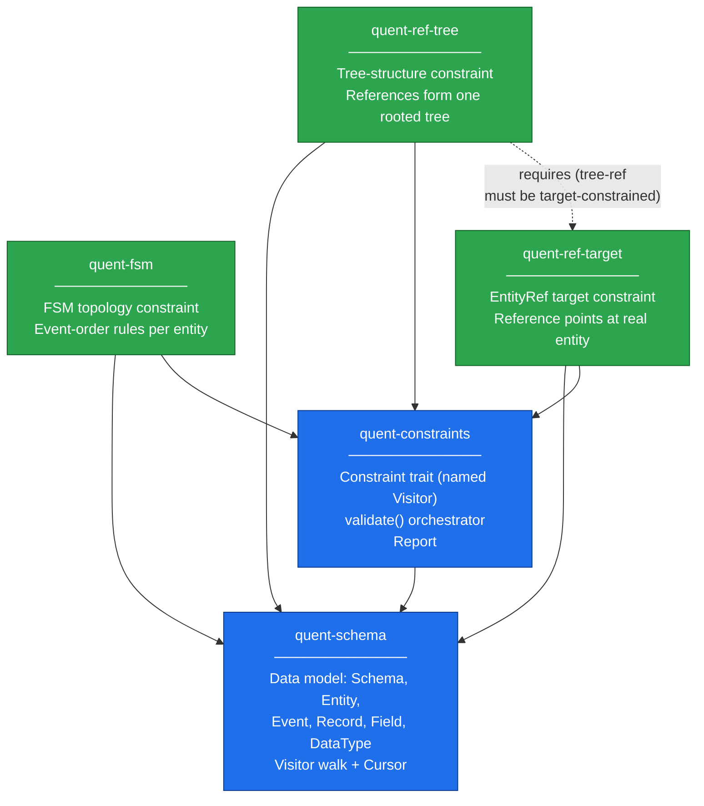

| Crate | Role | Depends on |
| --- | --- | --- |
| `quent-schema` | Dumb data model + Visitor walk | — |
| `quent-constraints` | Constraint trait + `validate()` orchestrator | `quent-schema` |
| `quent-fsm` | Enforces valid event ordering per entity | `quent-schema`, `quent-constraints` |
| `quent-ref-target` | Validates that an `EntityRef` names a real entity | `quent-schema`, `quent-constraints` |
| `quent-ref-tree` | Validates that tree-forming refs form one rooted tree | `quent-schema`, `quent-constraints`, *(reads)* `quent-ref-target` |

---

## 2. The two-layer design

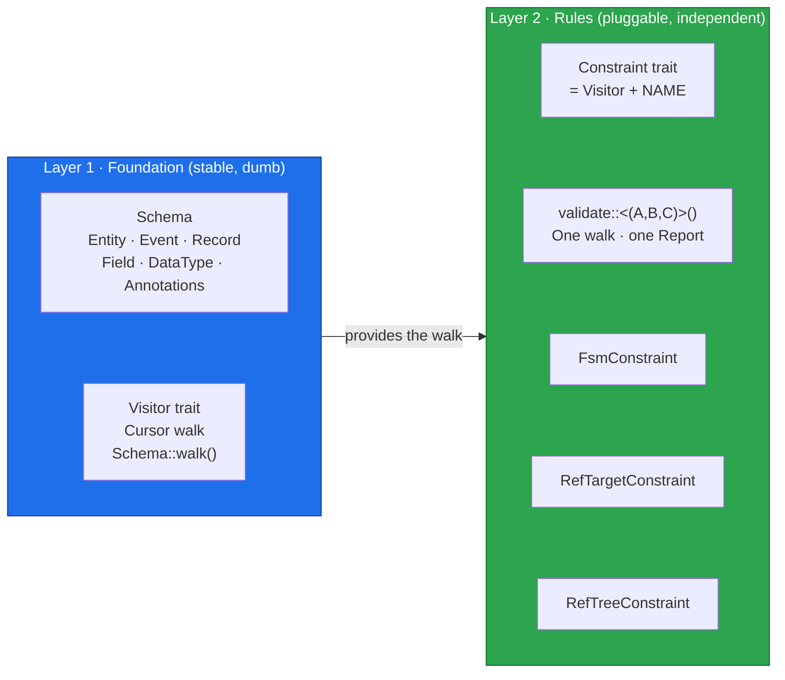

**Key insight.** The schema data model never learns domain rules. All domain
knowledge — "events must follow this order", "this reference must point at a
real entity", "these references must form a tree" — lives exclusively in
`Layer 2` crates. You add new rules by adding new crates; `quent-schema` never
changes.

---

## 3. `quent-schema` — the data model

### 3.1 Structure

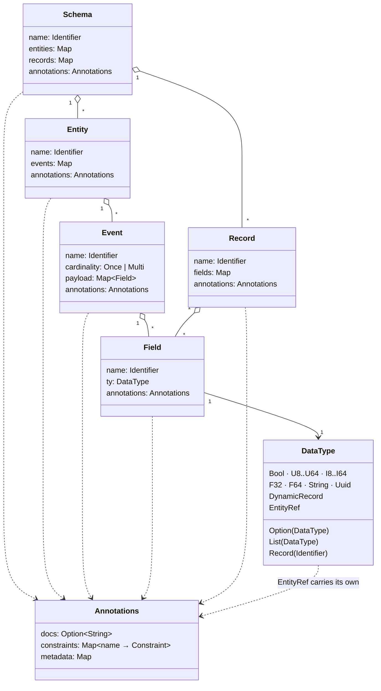

### 3.2 The Visitor walk

`Schema::walk(visitor)` performs a **depth-first** traversal, calling
`visitor.visit(&cursor)` at every node *before* its children. The `Cursor`
carries the complete path from the schema root so a visitor always knows
*where* it is.

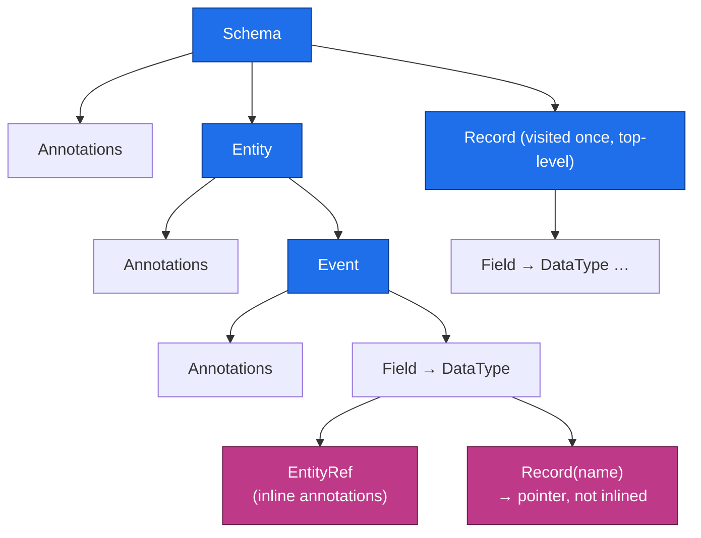

> **Record walk nuance.** A `Record(name)` field is a *pointer*; the walker
> does **not** descend into the referenced record at the field site. Each
> top-level `Record` is visited exactly once from `Schema::records`. Constraints
> that need to "follow" records (like `quent-ref-tree`) must build their own
> linking graph during the walk.

---

## 4. `quent-constraints` — the trait and the orchestrator

### 4.1 What a Constraint is

```mermaid
classDiagram
    class Visitor {
        <<trait — quent-schema>>
        type Output
        visit(cursor: &Cursor)
        finish() → Output
    }
    class Constraint {
        <<trait — quent-constraints>>
        const NAME: &'static str
    }
    Constraint --|> Visitor : requires Visitor + Default

    class FsmConstraint {
        NAME = "quent.fsm.v1"
    }
    class RefTargetConstraint {
        NAME = "quent.ref-target.v1"
    }
    class RefTreeConstraint {
        NAME = "quent.ref-tree.v1"
    }

    FsmConstraint ..|> Constraint
    RefTargetConstraint ..|> Constraint
    RefTreeConstraint ..|> Constraint

    classDef core fill:#1f6feb,stroke:#0b3a8c,color:#fff;
    classDef cons fill:#2da44e,stroke:#136229,color:#fff;
    class Visitor,Constraint core;
    class FsmConstraint,RefTargetConstraint,RefTreeConstraint cons;
```

A `Constraint` is exactly **a `Visitor` with a unique string name**. The name
is the same key used in the schema's `Annotations::constraints` map
(`"quent.fsm.v1"`, `"quent.ref-tree.v1"`, …), so the orchestrator can match
annotations to constraint implementations.

### 4.2 Single-pass validation

`validate::<(A, B, C)>(&schema)` composes all constraints — plus two built-in
checks — into a tuple visitor and walks the schema **exactly once**.

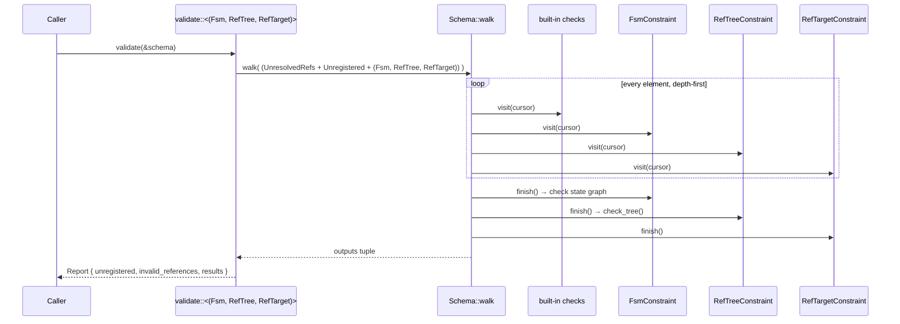

**Always-on built-ins** (not optional):

| Built-in | What it checks |
| --- | --- |
| `UnresolvedReferences` | Every `Record(name)` field resolves to a real top-level record |
| `UnregisteredConstraints` | Annotation names in the schema that were *not* passed to `validate` |

The single-walk design is why each constraint is a `Visitor`: the orchestrator
just puts them in a tuple and hands the tuple to the walker.

---

## 5. `quent-ref-target` — the prerequisite constraint

`ref-target` answers one narrow question:

> **"This `EntityRef` claims to point at entity `T` — does `T` exist in the schema?"**

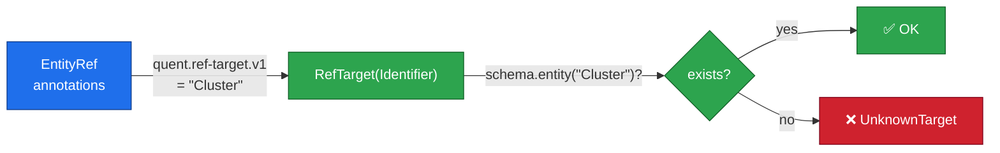

`ref-target` is the **prerequisite** for `ref-tree`. You cannot build a typed
tree out of references that do not even name a valid entity type.

---

## 6. `quent-fsm` — the event-order constraint

`fsm` answers one narrow question:

> **"Do the events of this entity follow the declared FSM topology?"**

It reads an FSM topology from the entity's annotations, builds a state graph
(via petgraph), and validates:

- Every declared state is reachable from the initial state.
- There are no isolated cycles that can never be escaped.
- The topology itself is consistent (no dangling transitions, no duplicate
  states).

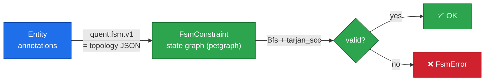

---

## 7. `quent-ref-tree` — the tree-structure constraint

`ref-tree` answers one narrow question:

> **"Do the entity references annotated as tree-forming together describe a
> single tree rooted at exactly one entity?"**

Its five requirements:

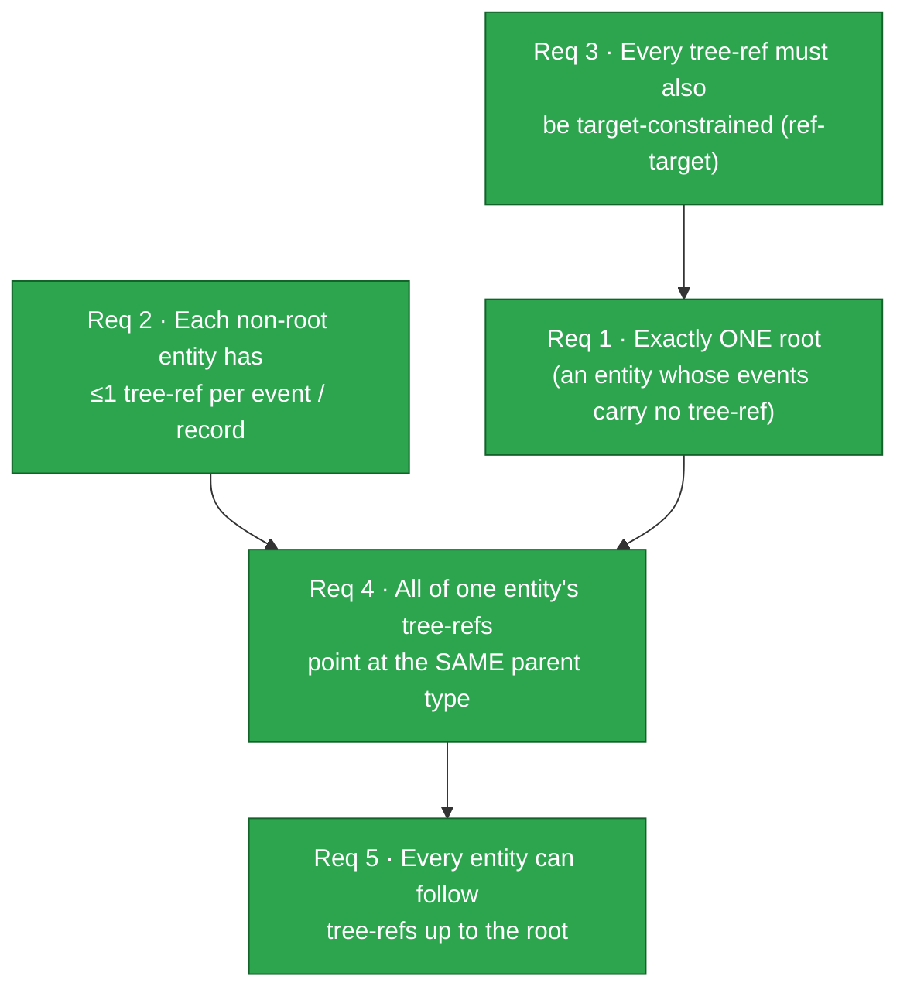

Because the `Record` walk nuance (§3.2) means records aren't followed inline,
`ref-tree` builds its own internal directed graph during the walk and collapses
it in `finish()`:

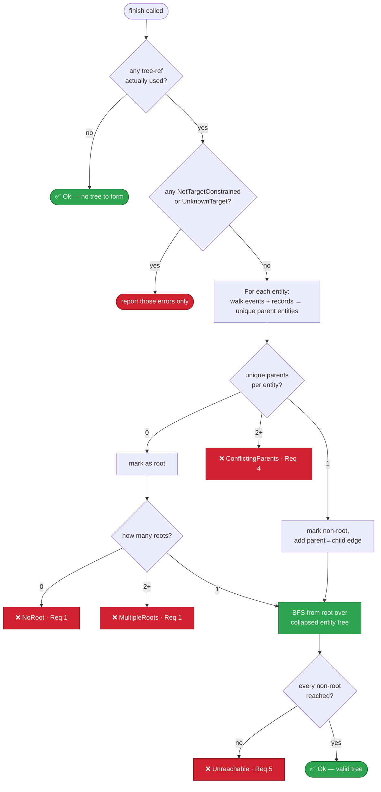

---

## 8. How the crates interplay at runtime

### 8.1 Constraint composition

All three constraints are `Visitor + Constraint`. They compose into a tuple
and are passed to `Schema::walk` in a **single pass**:

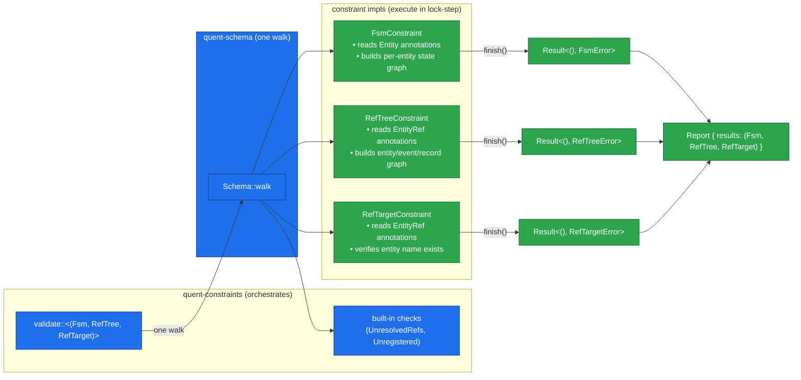

### 8.2 `ref-tree` depends on `ref-target` (not on the constraint, but on its data)

`ref-tree` does not *call* `RefTargetConstraint` during its walk. Instead, it
**reads the same annotation data** that `ref-target` writes, using the shared
`RefTarget::from_annotations(...)` helper. This is why requirement 3 exists:
if a tree-forming `EntityRef` lacks the `ref-target` annotation, `ref-tree`
has no parent to point at.

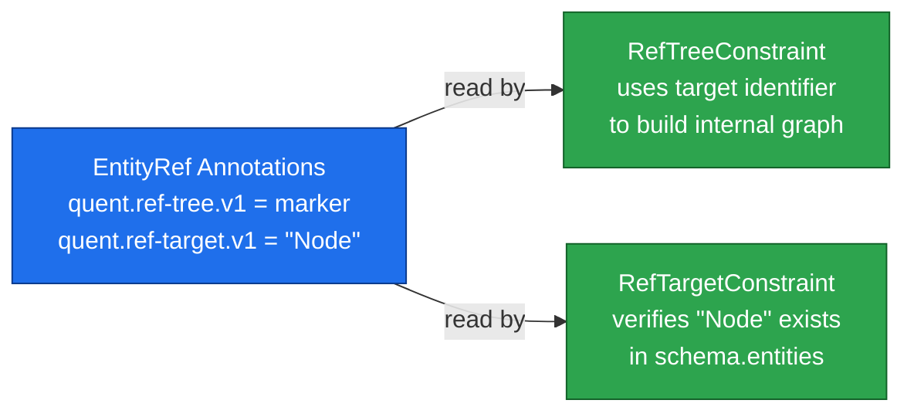

### 8.3 `fsm` and `ref-tree` are independent peers

They never call each other. Run together, they validate **two orthogonal
dimensions** of the same schema in one pass:

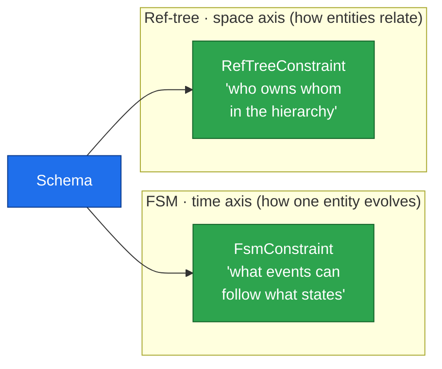

| | `quent-fsm` | `quent-ref-tree` |
| --- | --- | --- |
| Validates | **temporal order** of one entity's events | **spatial hierarchy** across all entities |
| Annotation lives on | `Entity` (FSM topology JSON) | `EntityRef` (marker + target) |
| Internal model | per-entity state graph (petgraph) | whole-schema entity/event/record graph |
| Graph algorithm | BFS + Tarjan SCC | DFS collapse + BFS reachability |
| Output | `Result<(), FsmError>` | `Result<(), RefTreeError>` |

---

## 9. Real-world example: a Kubernetes-style container platform

### 9.1 The domain hierarchy

A container platform has a natural ownership tree. Each entity is *owned by*
or *part of* its parent:

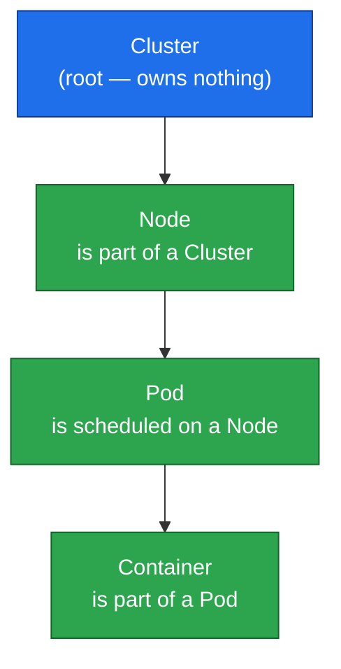

### 9.2 The event lifecycle of each entity (FSM dimension)

Each entity has a defined set of lifecycle events. `quent-fsm` enforces the
valid ordering:

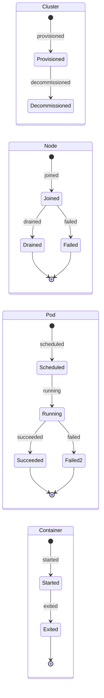

### 9.3 The tree-forming references (ref-tree + ref-target dimension)

Each non-root entity's first event carries a **tree-forming reference** to its
parent. That field's `EntityRef` is annotated with both `quent.ref-tree.v1`
(tree-forming marker) and `quent.ref-target.v1` (the parent entity name).

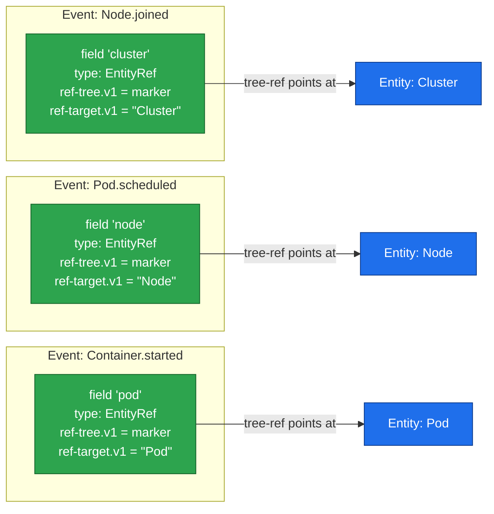

### 9.4 Building the schema with the builder API

```rust
use quent_constraints::{validate};
use quent_ref_target::RefTargetConstraint;
use quent_ref_tree::{RefTreeConstraint, RefTreeError};
use quent_fsm::FsmConstraint;
use quent_schema::{
    Cardinality, DataType, Identifier,
    builder::{AnnotationsBuilder, EntityBuilder, EventBuilder, SchemaBuilder},
};

fn id(s: &str) -> Identifier {
    Identifier::try_new(s).unwrap()
}

/// Builds a DataType::EntityRef that is BOTH tree-forming and target-constrained.
/// Both constraints read from the same annotations map.
fn parent_ref(parent: &str) -> DataType {
    let target = serde_json::to_string(&id(parent)).unwrap();
    DataType::EntityRef {
        data: None,
        annotations: AnnotationsBuilder::new()
            .constraint(RefTreeConstraint::NAME, None)   // tree-forming marker
            .unwrap()
            .constraint(RefTargetConstraint::NAME, Some(target)) // target name
            .unwrap()
            .build(),
    }
}

fn build_platform_schema() -> quent_schema::Schema {
    // Cluster: the root. No tree-forming refs in any of its events.
    let cluster = EntityBuilder::new(id("Cluster"))
        .event(EventBuilder::new(id("provisioned"), Cardinality::Once).build())
        .unwrap()
        .event(EventBuilder::new(id("decommissioned"), Cardinality::Once).build())
        .unwrap()
        .build();

    // Node: first event carries a tree-ref to Cluster.
    let node = EntityBuilder::new(id("Node"))
        .event(
            EventBuilder::new(id("joined"), Cardinality::Once)
                .field(quent_schema::Field::new(
                    id("cluster"),
                    parent_ref("Cluster"),
                    Default::default(),
                ))
                .unwrap()
                .build(),
        )
        .unwrap()
        .event(EventBuilder::new(id("drained"), Cardinality::Once).build())
        .unwrap()
        .event(EventBuilder::new(id("failed"), Cardinality::Once).build())
        .unwrap()
        .build();

    // Pod: tree-ref to Node on its "scheduled" event.
    let pod = EntityBuilder::new(id("Pod"))
        .event(
            EventBuilder::new(id("scheduled"), Cardinality::Once)
                .field(quent_schema::Field::new(
                    id("node"),
                    parent_ref("Node"),
                    Default::default(),
                ))
                .unwrap()
                .build(),
        )
        .unwrap()
        .event(EventBuilder::new(id("running"), Cardinality::Once).build())
        .unwrap()
        .event(EventBuilder::new(id("succeeded"), Cardinality::Once).build())
        .unwrap()
        .event(EventBuilder::new(id("failed"), Cardinality::Once).build())
        .unwrap()
        .build();

    // Container: tree-ref to Pod on its "started" event.
    let container = EntityBuilder::new(id("Container"))
        .event(
            EventBuilder::new(id("started"), Cardinality::Once)
                .field(quent_schema::Field::new(
                    id("pod"),
                    parent_ref("Pod"),
                    Default::default(),
                ))
                .unwrap()
                .build(),
        )
        .unwrap()
        .event(EventBuilder::new(id("exited"), Cardinality::Once).build())
        .unwrap()
        .build();

    SchemaBuilder::new(id("K8sPlatform"))
        .entities([cluster, node, pod, container])
        .unwrap()
        .build()
}
```

### 9.5 Running all three constraints together

```rust
fn main() {
    let schema = build_platform_schema();

    // A single walk validates FSM order, ref-target existence, and ref-tree shape.
    let report = validate::<(FsmConstraint, RefTreeConstraint, RefTargetConstraint)>(&schema);

    let (fsm_result, reftree_result, reftarget_result) = report.results;

    match fsm_result {
        Ok(()) => println!("✅ all entity FSM topologies are valid"),
        Err(e) => eprintln!("❌ FSM violation: {e}"),
    }
    match reftree_result {
        Ok(()) => println!("✅ entity references form a valid tree rooted at Cluster"),
        Err(RefTreeError::Multiple(errs)) => {
            eprintln!("❌ {} tree violations:", errs.len());
            for e in errs { eprintln!("  - {e}"); }
        }
        Err(e) => eprintln!("❌ tree violation: {e}"),
    }
    match reftarget_result {
        Ok(()) => println!("✅ all EntityRef targets are valid"),
        Err(e) => eprintln!("❌ ref-target violation: {e}"),
    }
}
```

### 9.6 What the constraint sees during the walk

During the walk `ref-tree` builds this internal graph…

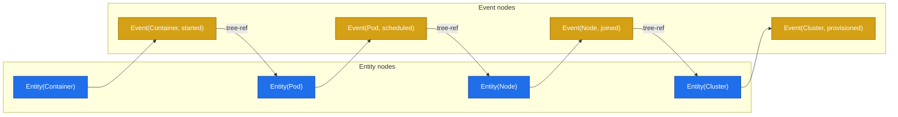

…and `finish()` collapses it to the clean entity tree:

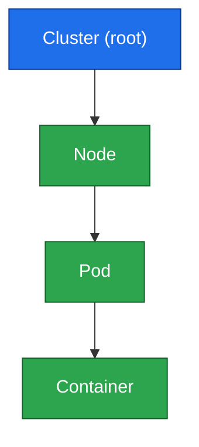

### 9.7 How violations map to errors

```mermaid
graph TD
    subgraph CP["❌ ConflictingParents (Req 4)"]
        CP1["Pod.scheduled → Node"]
        CP2["Pod.evicted   → Cluster"]
        CP1 -. "same entity, different\nparent types" .-> CPX["ConflictingParents"]
        CP2 -. .-> CPX
    end

    subgraph MR["❌ MultipleRoots (Req 1)"]
        MR1["Cluster (no parent)"]
        MR2["Region  (no parent)"]
        MR1 -. "both have zero parents" .-> MRX["MultipleRoots"]
        MR2 -. .-> MRX
    end

    subgraph UR["❌ Unreachable (Req 5)"]
        UR1["A → B"]
        UR2["B → A"]
        UR1 -. "cycle, never reaches root" .-> URX["Unreachable"]
        UR2 -. .-> URX
    end

    subgraph NT["❌ NotTargetConstrained (Req 3)"]
        NT1["EntityRef has\nref-tree.v1 marker"]
        NT2["but NO\nref-target.v1"]
        NT1 -. "missing prerequisite" .-> NTX["NotTargetConstrained"]
        NT2 -. .-> NTX
    end

    subgraph NR["❌ NoRoot (Req 1)"]
        NR1["Every entity has\nat least one tree-ref"]
        NR1 -. "nowhere to start BFS" .-> NRX["NoRoot"]
    end

    classDef err fill:#cf222e,stroke:#82071e,color:#fff;
    class CPX,MRX,URX,NTX,NRX err;
```

| Trigger | Error |
| --- | --- |
| An entity's events point at two different parent types | `ConflictingParents` |
| Two entities have zero tree-refs in all their events | `MultipleRoots` |
| Every entity has at least one tree-ref (no root exists) | `NoRoot` |
| An entity's events form a cycle that never touches the root | `Unreachable` |
| A `ref-tree` marker exists but `ref-target` annotation is missing | `NotTargetConstrained` |
| A `ref-target` annotation names an entity that isn't in the schema | `UnknownTarget` |
| An event carries more than one tree-forming ref | `MultiplePerEvent` |

---

## 10. Why this architecture is nice

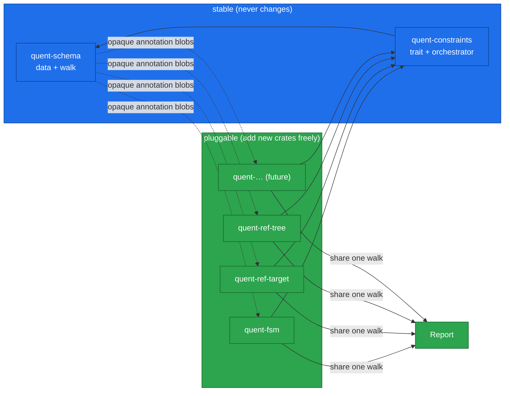

**Separation of concerns.** The schema never learns domain rules. New rules ship
as new crates; `quent-schema` never changes.

**Forward compatibility.** An unknown annotation name is *reported*
(`UnregisteredConstraints`), never silently ignored. Codegen can emit a working
API even before understanding a new constraint.

**Single-pass efficiency.** `validate::<(A, B, C)>` composes visitors into a
tuple and walks the schema once, regardless of how many constraints are active.

**Composability.** `ref-tree` reusing `ref-target`'s annotation data shows
constraints can layer on each other instead of duplicating logic.

**Orthogonality.** `fsm` and `ref-tree` describe the same schema from two
independent dimensions — time and space — without any coupling between them.

---

## 11. Adding your own constraint

Any crate can participate by implementing `Visitor + Constraint`:

```rust
use quent_schema::Visitor;
use quent_constraints::Constraint;

/// Example: enforce that every Entity has at least one event.
#[derive(Default)]
pub struct NonEmptyEntitiesConstraint {
    violations: Vec<String>,
}

impl Visitor for NonEmptyEntitiesConstraint {
    type Output = Result<(), Vec<String>>;

    fn visit(&mut self, cursor: &quent_schema::Cursor) {
        if let Some(entity) = cursor.as_entity() {
            if entity.events.is_empty() {
                self.violations.push(entity.name.to_string());
            }
        }
    }

    fn finish(self) -> Self::Output {
        if self.violations.is_empty() { Ok(()) } else { Err(self.violations) }
    }
}

impl Constraint for NonEmptyEntitiesConstraint {
    const NAME: &'static str = "my-org.non-empty-entities.v1";
}

// Usage: compose it in alongside the built-in constraints.
// let report = validate::<(FsmConstraint, RefTreeConstraint, NonEmptyEntitiesConstraint)>(&schema);
```

The new constraint is automatically included in the single-walk pass with no
changes required to `quent-schema` or `quent-constraints`.
