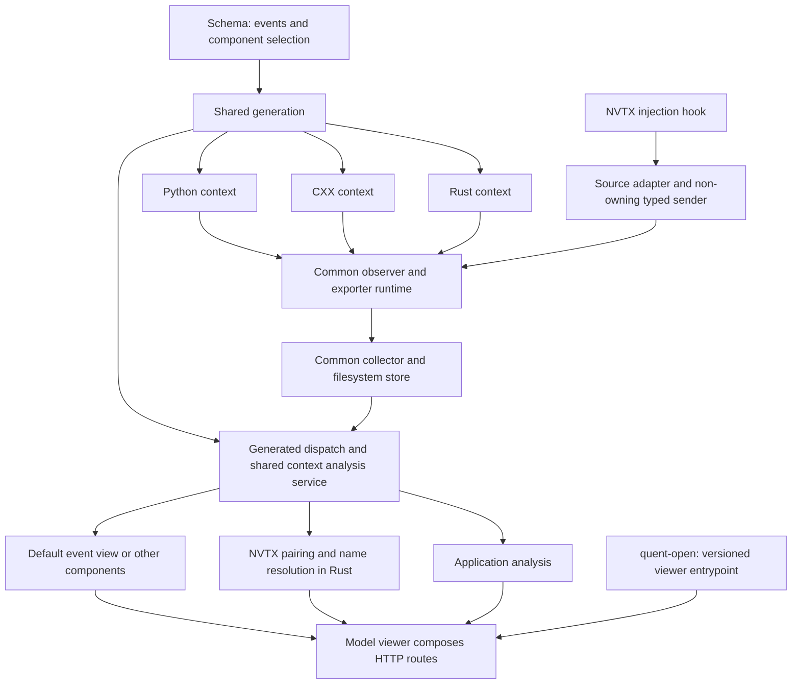

<!--
SPDX-FileCopyrightText: Copyright (c) 2026, NVIDIA CORPORATION & AFFILIATES. All rights reserved.
SPDX-License-Identifier: Apache-2.0
-->

# Issue 618, approach 1: reusable reconstruction components

The shared pipeline delegates NVTX interpretation to a reusable Rust component.



Status: alternative design for review; no implementation performed.
Prepared 2026-09-17 for
[rapidsai/quent#618](https://github.com/rapidsai/quent/issues/618).
Read the [comparison and review questions](618-plan.md),
[approach 2](618-approach-2-declarative.md), and
[research and source references](618-research.md) with this plan.

## Handoff instructions

Implementation is reserved for sol after design review and a separate
implementation instruction. The current preference is approach 2; this plan
provides the concrete alternative for comparison, not an implicit fallback.

When implementing, first recheck PRs #638 and #699. At research time #638 was
merged and #699 was open. Follow [AGENTS.md](../../AGENTS.md): if #699 is still
open, explain the overlap and obtain user direction before editing frozen
areas. The default plan is to implement after #699 merges, on its resulting
architecture. Do not revive the legacy model macros or CXX generator.

The recommendations below apply if approach 1 is selected. They are proposed
API contracts, not existing behavior or an approved implementation direction.

## Target outcome

A model declares auxiliary events in its schema. Generated Rust, CXX, and Python
contexts expose them through the common typed runtime; all existing transport
backends carry them. One schema-derived inventory drives loading and common
analysis orchestration. NVTX reconstruction participates in that orchestration,
and its existing HTTP/UI views consume the resulting context analysis.

Adding an ordinary second auxiliary stream must require only a schema change
and regeneration. A new specialized analysis may supply a reusable component,
but must not require another exporter, filesystem importer, cache lifecycle,
or `quent-open` branch. New custom UI semantics still require presentation code.

“Single” means shared implementations and lifecycle. It does not require one
physical output file, one untyped payload, or one algorithm for unrelated event
semantics.

## Proposed architecture

### 1. Start with existing schema entities and repeated events

Use a schema entity as the typed container for an auxiliary stream. Its one
logical instance is the capture context. All its events have `multi: true`.
Use a semantic annotation to identify context scope; keep stream names and
payload layout derived from actual schema declarations.

Proposed YAML, using the existing grammar:

```yaml
quent: alpha
model: Example
entities:
  Aux::Sample:
    metadata:
      quent.stream.scope: context
    events:
      sample:
        multi: true
        attributes:
          value: u64
```

Proposed optional analysis selection:

```yaml
metadata:
  quent.stream.scope: context
  quent.analysis.component: nvtx.core.v1
```

These keys are new conventions to implement and validate, not existing
features. Metadata only selects context binding and interpretation. The schema
must contain every event and record; an annotation must not silently add an
opaque NVTX event type or alter serialization.

For context streams, generate a convenience sender/handle bound to
`context.id()`. Reuse existing entity-event generation, umbrella variants,
exporter-provider bounds, and collector/store registration. Reject invalid
scope values, non-repeating context events, conflicting FSM/resource semantics,
and unresolved analysis component names with precise schema locations.

This is the recommended first design because the infrastructure already treats
an entity's events as a stream. A separate top-level `streams:` schema category
would duplicate traversal and generation across several crates. Introduce one
only if the first vertical slice demonstrates a concrete semantic limitation
that context-scoped entities cannot represent; document that evidence first.

### 2. Keep NVTX vocabulary portable and lossless

Provide one canonical NVTX schema fragment in a small, platform-independent
integration build module, tentatively `integrations/nvtx/schema`. It contributes
records and one repeated-event entity to the application schema. Both YAML
loaded schemas and Rust-built schemas must compose it through the same helper.
All generators and the store consume the same composed schema.

Cover all 12 currently captured variants: push, pop, start, end, mark, domain
create/destroy, string registration, category/thread naming, and resource
create/destroy. Preserve context UUID, timestamp, raw domains, IDs, tags,
attributes, and UTF-8 values. Deferred payload-extension capture stays deferred.

The current schema cannot express native Rust tagged unions. Recommended bounded
encoding using existing schema types:

| Native data | Portable schema representation |
| --- | --- |
| Color | Record containing raw `color_type: i32` and `value: u32` |
| Optional message | Optional record with a kind discriminator and mutually exclusive string/registered-handle fields |
| Optional payload | Optional record with original `payload_type: i32`, value-kind discriminator, and `value_bits: u64` |
| Event attributes | Record containing category and the optional color/message/payload records |

Define every discriminator value in the canonical schema module. Preserve
signed values and float bit patterns in `value_bits`, including negative zero
and NaNs; distinguish raw payload tag from the selected union member. Validate
message exclusivity and 32-bit payload bounds during conversion. Invalid input
must produce a typed error, not a fabricated value or panic.

Keep `nvtx-events` independent of Quent and keep the existing reconstruction
algorithm working with its vocabulary. Convert at the schema/source and
schema/reconstruction boundaries. Do not serialize and deserialize through
JSON on every captured event to perform these conversions.

Generated instrumentation and store modules have distinct Rust type identities.
Supply a reusable adapter generator with the NVTX schema module, parameterized
by the generated module path, to emit conversions for both consumers. Invoke
it through the common build-time component binding described below. Require
schema/version validation before generating those conversions. This avoids
handwritten per-application conversion matches or a global type-alias refactor.

The recommended representation is a new schema-described wire shape. Historical
captures retain their original format and are opened through their pinned legacy
viewer. Do not promise byte-for-byte compatibility with `NvtxEventEntity`.
Record the new schema's identity/version and test this boundary explicitly. If
unchanged wire bytes become a user requirement, revisit this encoding before
implementation; general union support or external type binding would then be a
separate design cost.

### 3. Generate common analysis dispatch

Introduce a small shared component contract in `quent-analyzer` and generation
support, tentatively `quent-analyzer-build`. Derive routing from the same schema
paths used by instrumentation and `quent-store`.

A component receives one typed stream for one context and produces a typed
analysis result. It may buffer and finalize in multiple passes. Every ordinary
auxiliary stream has a default component exposing its ordered typed events and
basic inventory; it must work without a specialized component registration.

Resolve optional component IDs through an explicit trusted build-time binding
table. For NVTX, one integration helper registers `nvtx.core.v1`, its conversion
generator, reducer, and presentation integration. No runtime plugin download,
schema-supplied Rust source, or manually maintained model event-name switch is
needed. The model composition call is reusable library configuration; per-model
generated dispatch is produced automatically.

Place per-context loading and component results under one common service/cache.
Keep typed payloads through dispatch; avoid introducing erased serialized event
blobs or a second exporter abstraction. Component-specific result types and
query-origin-dependent presentation caches are fine; independent filesystem
loading and reconstruction caches per integration are not the target design.

Application analyses may aggregate multiple contexts. Retain context identity
while dispatching and reconstruct NVTX independently per context. Do not merge
NVTX raw handle spaces just because an engine includes several contexts.

### 4. Separate source attachment from context construction

Expose a non-owning, context-bound typed sender from the shared context runtime.
The NVTX source adapter converts captured events and forwards them through that
sender. Attaching the process-global source is an explicit integration
operation; declaring an event stream does not claim the global hook.

Rust, CXX, and Python integration entrypoints should delegate to that same Rust
attachment helper when capture is enabled. Schema emission/replay remains usable
without injection, including on platforms that cannot compile `nvtx-injection`.
No-op contexts must not create exporters or claim the hook.

Maintain the current single-context ownership restriction. Surface
`AlreadyInstalled` explicitly; do not copy the legacy ignored installation
result. The hook closure must not retain an owning context, observer, or handle.
Test flushing after the final ordinary owner drops while the hook still exists.
Registration/unregistration, route guards, and metadata replay belong to #696.

For consumers migrating from the default-on legacy CXX path, include explicit
attachment in their initialization recipe so capture does not silently vanish.
Document that step in the Sirius handoff; changes to the Sirius repository are
not part of this plan's implementation authorization.

### 5. Put viewer composition behind one versioned entrypoint

Have the producing model's viewer expose a stable route-construction entrypoint,
for example `Viewer::router(options)`. Its implementation composes the common
context service, application routes, and registered presentation components.
Put that implementation in the model's analyzer/viewer package so `quent-open`
can depend on one producing package. Avoid a server/analyzer dependency cycle;
shared interfaces must remain independent of concrete model implementations.

The new `quent-open` wrapper calls this entrypoint without knowing about NVTX,
specific auxiliary event types, or individual extension crate names.

Use one optional viewer protocol field in `ModelInfo`/`model.qmi`, tentatively
`viewer_api: 1`. Absence selects the historical wrapper. Only advertise the
new protocol when the paired viewer implements it; expose an explicit generator
option rather than automatically labeling every model using a newer runtime.

Propagate protocol selection into `ViewerSpec`, grouping, and cache keys.
Unknown versions fail clearly. Keep the historical NVTX/package fallback logic
confined to the legacy path. A new stream must not change either wrapper path.
Do not remove historical support merely to make an NVTX text search empty.

## Ordered implementation work packages

Each package should leave reviewable code and its focused validation. Suggested
commit boundaries are the packages below, split further if needed. Follow the
repository's DCO requirements if commits are requested.

### A0. Refresh the base and capture regression expectations

Read current AGENTS instructions; recheck both migration PRs; inspect the merged
PR #699 file layout and APIs. Reconcile changes after the research anchors
before editing. Reuse existing reconstruction/HTTP test fixtures as behavior
oracles. Identify one complete existing artifact and its pinned viewer for
historical compatibility testing; also retain missing-stream and empty-stream
fixtures.

Exit: the implementation base, proposed metadata keys, wire-shape choice, and
viewer protocol boundary are documented. The migration freeze is satisfied or
the user has explicitly directed how to handle the overlap.

### A1. Prove the generic schema stream in all three languages

Implement context-scope annotation validation and a context-bound stream API.
Begin with `Aux::Sample`, without NVTX dependencies. Generate its observer,
umbrella conversion, collector route, and typed store using current machinery.
Exercise emission from Rust, a compiled CXX fixture, and Python at runtime.

Primary files: `crates/instrumentation-build/src/{events,model,runtime/*}.rs`,
`crates/instrumentation/src/{model,entity,observer}.rs`, schema/YAML validation
and tests as needed, plus the CXX/PyO3 generators and their fixtures.
Keep ordinary entity and FSM behavior unchanged.

Exit: all three languages emit the same schema-defined stream; context IDs and
payloads agree; no-op and observer lifetime behavior remain correct. Merely
asserting generated source text contains a method is insufficient.

### A2. Add common availability and analysis orchestration

Extend the common store with availability metadata distinguishing undeclared,
missing, present-empty, and populated streams. Preserve per-file format handling
and deterministic file order. Build the generated component dispatcher and
common context service/cache against the synthetic stream.

Define ownership of cached event buffers and results before wiring the server.
Reuse decoded data where both application and auxiliary analysis need it;
document any necessary cloning at an existing owned-event API boundary. Keep
the service scoped to its store root/model as well as context IDs.

Primary files: `crates/store/src/event/{mod,filesystem}.rs`,
`crates/store-build/src/lib.rs`, `crates/analyzer/src/`, new analysis generation
module/crate, and common server context/cache interfaces.

Exit: adding `Aux::SecondSample` to a fixture schema works through loading and
default analysis without handwritten importer or dispatch changes. Concurrent
requests share work; malformed input is an error, not a successful empty stream.

### A3. Define the NVTX schema and bridge capture

Add the canonical schema fragment, reusable conversions, build-time component
binding, and separate attachment helper. Generate instrumentation and store
adapters from the same definition. Route capture through the common model
observer and normal provider instead of owning a separate pipeline.

Primary files: proposed `integrations/nvtx/schema/`,
`integrations/nvtx/bridge/`, `integrations/nvtx/example/`, common build
bindings, and package manifests. Change `nvtx-injection` only if a small
attachment seam is needed; do not implement its routing redesign.

Exit: native capture round-trips all variants through the composed schema
without losing tags, bits, handles, timestamps, or context. Injection-free
replay builds independently of Linux capture features.

### A4. Move reconstruction and HTTP reads onto the common service

Wrap the existing two-pass `NvtxModelBuilder` as the registered component.
Adapt its input through the generated converter and retain its output contracts.
Replace NVTX's dedicated importer and model cache in the new server path with
the common context service. Leave catalog/viewport projection code in the NVTX
presentation package where useful.

Wire the application viewer and standalone simulator server to the same service.
Use #699's context inventory API to preserve per-context ownership before
engine aggregation. Missing/empty availability must survive to the HTTP layer.

Primary files: `integrations/nvtx/analyzer/`, `integrations/nvtx/server/`,
`domains/query_engine/server/src/{lib,state,analyzer_cache}.rs`, the merged
`experimental/vibe/simulator/{analyzer,store,server}/`, and viewer interfaces.

Exit: existing reconstruction and HTTP/UI contract tests pass through the new
path; multiple contexts with identical raw NVTX handles remain isolated. The
new path no longer has an independent NVTX filesystem importer/reconstruction
cache. Bound expensive blocking work and preserve request/error behavior.

### A5. Finish language integration and migration examples

Expose the NVTX schema event methods and optional attachment entrypoints through
the schema CXX and PyO3 generators. Verify both direct typed emission and real
capture through the shared helper. Keep core language generators generic; NVTX
adapter emission belongs to its reusable integration binding.

Update Rust/CXX/Python examples and type stubs. After #699, confirm the old
`model.nvtx` and `_nvtx_pipeline` implementation is already removed; remove only
remaining temporary wiring, without resurrecting deleted crates to edit them.

Exit: no model-specific extra NVTX observer is required in any language. Each
source-attachment test runs in a fresh process to respect the global hook.
Migration instructions cover explicit capture attachment and the remaining
single-context limitation.

### A6. Introduce the viewer protocol and migrate quent-open

Implement the model-owned route factory and opt-in provenance field. Generate
the new minimal wrapper, preserving existing legacy behavior. Update source
validation, grouping/cache identity, metadata fixtures, and wrapper tests.

Primary files: `crates/build-info/src/lib.rs`, generator model provenance,
`crates/open/src/{spec,wrapper,viewer}.rs`, model viewer composition, and tests.

Exit: a model with two different auxiliary streams uses the same wrapper
structure as one with NVTX alone; no new dependency probes are needed. Build
and exercise viewers for both an old pinned capture and a new unified capture.

### A7. Run the completion matrix and document extension points

Finish the focused scenarios below, then the applicable canonical repository
checks. Update integration documentation with one worked example adding an
ordinary stream and one example registering a specialized analysis component.
Record any environment-limited check as unverified rather than passed.

Exit: every issue acceptance criterion has concrete evidence; the final report
distinguishes shared transport/analysis from the deferred #696 attachment work.

## Completion and regression matrix

| Concern | Required evidence |
| --- | --- |
| Extensibility | Add a second schema-only auxiliary stream without modifying exporters, importers, common analyzer dispatch, server cache code, or `quent-open` |
| Language parity | Rust, compiled CXX, and runtime Python emit the same auxiliary/NVTX schema payloads and context identity; generated stubs match Python behavior |
| Backends | NDJSON, MessagePack, and Postcard round trips; callback observation; collector delivery through generated routing |
| Collector provenance | A collector-created sink uses the same composed schema and context ID; its construction never installs the source hook |
| Schema validation | Existing schemas remain valid; invalid scope/cardinality/component bindings and name collisions fail clearly; unresolved components never silently disappear |
| Type identity | Instrumentation and store adapters compile against independently generated modules, not accidental shared Rust types |
| NVTX vocabulary | All 12 variants, UTF-8 names, registered messages, color/category tags, signed/unsigned widths, float bits, and absent attributes survive conversion |
| Replay semantics | Out-of-order and tied timestamps, late registrations, nested push/pop, cross-thread start/end, incomplete pairs, reused IDs, and resource lifetimes match existing fixtures |
| Context isolation | Equal domain/thread/range/resource IDs in different contexts do not cross-pair, including contexts aggregated under one engine |
| Availability/errors | Missing stream returns 404; empty stream returns an empty successful result; corrupt/disabled-format streams report errors; error bodies stay redacted |
| Ordering | Deterministic file/stream traversal and stable equal-timestamp replay; concatenated store iteration is not mistaken for chronological order |
| Lifecycle | No-op creates no pipeline/hook; ordinary observers retain documented lifetime; a global hook's sender does not prevent final-owner flush |
| Native attachment | Preserve the consumer's actual link setup and callback initialization for NVTX calls originating in instrumented shared libraries |
| Shared service | Concurrent misses coalesce, expensive work is limited, failures can be retried, and query-origin-dependent catalogs do not contaminate each other |
| UI | Existing endpoint shapes, time origins, incomplete-range rendering, grouped domains/source IDs, category selections, colors, and statistics remain unchanged |
| Viewer compatibility | Missing protocol selects legacy; new protocol builds unified viewer; unknown protocol errors; cache keys distinguish protocols; old pinned artifacts still open |
| Platform separation | Portable vocabulary/store/replay does not pull in Linux-only injection; capture smoke tests run on supported Linux targets without a GPU |

Use current NVTX fixtures as input/oracle data rather than replacing them with
tests that reproduce the new dispatcher. A synthetic stream is mandatory: NVTX
alone cannot demonstrate that the architecture is extensible.

## Suggested verification commands

Reconcile package names/features with the merged base and newly added crates.
Focused starting points on the current layout:

```sh
pixi run cargo test -p quent-schema -p quent-yaml -p quent-instrumentation-build --locked
pixi run cargo test -p quent-instrumentation -p quent-store -p quent-store-build --all-features --locked
pixi run cargo test -p nvtx-analyzer -p nvtx-ui -p nvtx-server -p quent-open --all-features --locked
pixi run cargo test -p nvtx-example --locked
pixi run cargo test --manifest-path experimental/vibe/codegen/Cargo.toml --workspace --locked
pixi run maturin develop --uv -m experimental/vibe/codegen/python/test/bridge/Cargo.toml
pixi run pytest experimental/vibe/codegen/python/test
```

Run the repository's [canonical checks](../../DEVELOPMENT.md) after focused
checks pass. On supported Linux, full `--workspace` Rust checks include opt-in
NVTX/bridge crates. They still do not include the nested codegen workspace.
Run `pnpm ci:check` and the relevant existing UI end-to-end cases when generated
bindings or client integration change. Capture smoke tests require the native
compiler/libclang tooling supplied by Pixi, but no GPU.

For the documentation itself:

```sh
rumdl check docs/plans/618*.md
```

## Risks and explicit boundaries

| Risk or alternative | Decision for this plan |
| --- | --- |
| #699 moves/removes target files | Rebase the plan on its merged APIs before implementing; do not maintain a parallel legacy implementation |
| Interpreting “single analyzer” as schema-defined range pairing | This alternative shares the lifecycle but keeps NVTX rules in Rust; choose approach 2 if the rules must also be declarative |
| Native NVTX enums exceed the current schema type system | Use validated lossless tagged records; do not add general sum types across all generators as an incidental prerequisite |
| New wire shape surprises downstream tools | Document the boundary and prove old pinned viewer support; unchanged-wire compatibility is not assumed |
| Metadata creates hidden wire behavior | Require complete explicit event/record definitions in the composed schema; annotations only select interpretation/context binding |
| A custom component becomes another hidden pipeline | Require shared store/service ownership and generated routing; audit for private filesystem loaders and duplicate context caches |
| Generic extension work grows into a runtime plugin system | Limit it to trusted build-time bindings and typed generation needed for default streams plus NVTX |
| Source hookup leaks into pure schema generation | Keep attachment optional and outside ordinary context/collector initialization |
| Fixing related source ownership expands scope | Leave multi-context routing to #696 and multi-tool coexistence to #374 |

Only design documents are included in this proposal. Implementation and runtime
verification remain work for the authorized sol implementation turn.
