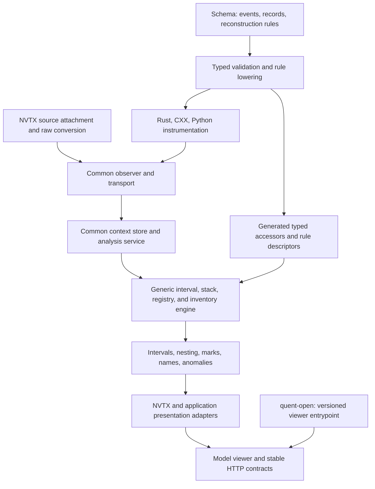

<!--
SPDX-FileCopyrightText: Copyright (c) 2026, NVIDIA CORPORATION & AFFILIATES. All rights reserved.
SPDX-License-Identifier: Apache-2.0
-->

# Issue 618, approach 2: declarative reconstruction

The schema supplies reconstruction rules to a shared generic analysis engine.



Status: preferred direction for review; no implementation performed.
Prepared 2026-09-17 for
[rapidsai/quent#618](https://github.com/rapidsai/quent/issues/618).
Read the [comparison and review questions](618-plan.md),
[approach 1](618-approach-1-components.md), and
[research](618-research.md) alongside this plan.

## Goal and handoff

Declare event shapes and reconstruction rules in the model schema. Generate
typed instrumentation and analysis bindings from that schema. Shared analysis
primitives reconstruct ranges, stacks, registrations, marks, and lifetimes.
NVTX supplies declarations and capture/presentation adapters, while the new
production path performs reconstruction without a dedicated NVTX reducer.

An additional source using these primitives must need only event declarations,
reconstruction rules, and regeneration. A new semantic pattern can still require
an extension to the generic engine; this plan does not promise that arbitrary
analysis can be expressed with the initial vocabulary.

Implementation is reserved for sol after design review and a separate
implementation instruction. Do not implement approach 1 as a prerequisite or
quietly fall back to it if a rule is difficult to express.

Recheck [PR #638](https://github.com/rapidsai/quent/pull/638) and
[PR #699](https://github.com/rapidsai/quent/pull/699) before implementation.
At research time #638 was merged and #699 remained open at
`db49fbb6115c0b22f688bd9417a192fb5526993b`. Follow the
[migration freeze](../../AGENTS.md). The default implementation base is the
merged #699 architecture; overlapping implementation before that needs explicit
user direction. Documentation review can proceed now.

## Proposed architecture

“Declarative” describes the source of the rules. It does not require parsing
YAML or interpreting field-name strings for every captured event. Prefer
validation and compilation of rules at build time, with typed generated
accessors invoking a shared runtime engine.

## Concrete schema examples

The following `reconstruction:` syntax is proposed, not supported today. The
examples illustrate the intended contracts; review and freeze the precise
grammar in B1 before implementing it. Their simplified payloads omit normal
NVTX attributes to keep the pairing rules readable.

### Keyed start/end ranges

```yaml
quent: alpha
model: Example
entities:
  Nvtx:
    metadata:
      quent.stream.scope: context
    events:
      range_start:
        multi: true
        attributes:
          range_id: u64
          name: string
      range_end:
        multi: true
        attributes:
          range_id: u64
    reconstruction:
      version: 1
      rules:
        ranges:
          kind: keyed_interval
          scope: context
          open: range_start
          close: range_end
          open_key: [range_id]
          close_key: [range_id]
          label_from: open.name
          unmatched_open: keep_open
          unmatched_close: count_and_skip
          reused_open: keep_previous_open_and_replace
```

The event envelope supplies timestamps. For start at 10 ms and end at 25 ms,
the generic engine emits an interval from 10 to 25 ms. At end of capture, a
start without an end emits an interval with `end: None`, not an invented close.

### Nested push/pop ranges

For an entity declaring `range_push` and `range_pop` with domain/thread fields,
the corresponding rule would be:

```yaml
reconstruction:
  version: 1
  rules:
    nested_ranges:
      kind: stack_interval
      scope: context
      push: range_push
      pop: range_pop
      partition_by: [domain, thread_id]
      label_from: push.name
      parent: previous_stack_entry
      unmatched_push: keep_open
      unmatched_pop: count_and_skip
```

Input `push(query), push(scan), pop, pop` produces a query interval with a
nested scan interval. Another thread or domain has a separate stack.

### Registered names and forward references

A registration can arrive after the range referring to it. The lookup policy
must be part of the declaration, rather than an assumption inside NVTX code:

```yaml
reconstruction:
  version: 1
  rules:
    strings:
      kind: registry
      scope: context
      event: register_string
      key: [domain, handle]
      value: string
      visibility: whole_capture
      duplicate: last_in_stable_order
```

An interval's label projection references this registry with its domain and
message handle. That projection must also distinguish an immediate message,
an unresolved registered handle, and no message. Define typed selectors for
those cases; do not hide the lookup or its history policy in an NVTX callback.

### Second source: HTTP requests

An independent schema can reuse `keyed_interval`:

```yaml
reconstruction:
  version: 1
  rules:
    requests:
      kind: keyed_interval
      scope: context
      open: request_started
      close: request_finished
      open_key: [request_id]
      close_key: [request_id]
      label_from: open.route
      unmatched_open: keep_open
      unmatched_close: count_and_skip
      reused_open: keep_previous_open_and_replace
```

Declare the two repeated events and their fields in the same entity. A
5 ms start and 12 ms finish must yield a 7 ms request interval with no HTTP
reducer, new importer, or viewer compatibility branch. This is a required
extensibility proof, not a request to build an HTTP integration product.

## Schema representation and validation

Reuse context-scoped entities with repeated events and the existing event/record
type system. Add a typed reconstruction specification, builder, and validator,
tentatively in `crates/reconstruction` (`quent-reconstruction`). Use the
existing `quent-fsm` extension pattern as a starting point, not its strict
event-lifecycle semantics.

Recommended lowering: the structured entity-level YAML block becomes a
versioned, validated schema constraint payload such as `reconstruction`.
Rust-built schemas use the equivalent typed builder. The constraint validates
the declaration against event types; it does not require every observed range
to have a complete lifecycle. Existing schemas without this annotation remain
valid and use their existing analysis or the default event view.

This preserves the schema annotation contract: reconstruction declarations
describe interpretation without changing the declared event wire layout.
Compare a first-class schema field as an alternative during review, but do not
support two independent representations in the first implementation.

Validation must cover:

- Supported specification version, unique rule names, and recognized primitive
  and policy names. Unsupported reconstruction annotations must fail clearly
  rather than being treated as ignorable metadata or a warning.
- Resolvable event and field paths, including nested records, in the owning
  entity. Rule references are scoped; v1 does not need cross-stream joins.
- Exactly matching tuple types for open/close keys. Restrict keys to stable
  scalar types; reject floating, dynamic, collection, or unresolved optional
  keys unless an explicit supported selector makes them definite.
- Compatible projection types and explicit handling of optional fields and
  tagged records. Do not silently coerce integer widths or substitute zero.
- Valid registry dependencies and a schedulable pass order. Reject cycles and
  duplicate/conflicting use of a name. One event may deliberately contribute
  to both a registry/inventory and a range rule; that fan-out is generated.
- Repeated-event cardinality and no conflicting FSM interpretation on a
  context-stream entity. Do not impose NVTX-specific names or fields globally.
- Precise diagnostic paths, such as
  `entities.Nvtx.reconstruction.rules.ranges.close_key[0]`.

Run the same validation from YAML loading, Rust generation, store generation,
analysis generation, and both language generators. Otherwise a producer and its
analyzer could accept different interpretations of the same model.

## Bounded reconstruction vocabulary

The first version covers the behavior already required by the current NVTX
capture, plus the second-source proof. It is not a general scripting language.

| Primitive | Inputs and policies | Output or state |
| --- | --- | --- |
| Keyed interval | Open/close selectors, typed key tuples, duplicate/open/close policies | Start/end ranges and resource lifetimes, including open intervals |
| Stack interval | Push/pop selectors, typed partition tuple, unmatched policies | Nested intervals with stable parent identity |
| Registry | Registration selector, key/value projections, whole-capture visibility, deterministic duplicate policy | Domain-scoped strings/categories and context-scoped thread/domain names |
| Inventory/fold | Observation selectors, identity keys, earliest/latest timestamp folds, distinct-key collection | Domains, threads, categories, observed bounds, captured lifecycle bounds |
| Instant | Event selector and typed projections | Marks |
| Projection | Typed field selection, literal values, presence/tag selection, registry lookup | Labels, raw attributes, categories, and references carried into results |
| Diagnostics | Per-rule unmatched/reused-key counters and error locations | Generic anomaly counts mapped to existing presentation fields |

Selectors are a finite typed expression tree, not arbitrary Rust/Python or an
embedded query language. Specify only operations required by these declarations.
Human-readable fallback formatting may remain in presentation code if it is
given unresolved keys and resolution status explicitly. Key matching, lookup
visibility, and temporal behavior must remain in the declarations/engine.

The common engine lives under `quent-analyzer`; a small analysis generator
emits typed field accessors, rule descriptors, and dispatch from the schema.
Package boundaries are provisional: reuse existing modules if that avoids a
new crate or dependency cycle. Core definitions and engine code must not import
NVTX enums or branch on an NVTX stream name.

## NVTX semantic mapping and compatibility

The NVTX profile must account for all 12 current variants. The following keys
and policies are derived from the existing implementation, not inferred from
similar names:

| Existing behavior | Declarative mapping |
| --- | --- |
| `RangeStart` / `RangeEnd` | Keyed interval using `(context, range_id)`; do not add thread/domain to this correlation key |
| `RangePush` / `RangePop` | Stack interval partitioned by `(context, domain, thread_id)` |
| `ResourceCreate` / `ResourceDestroy` | Keyed lifetime using `(context, handle)`; destroy has no domain field |
| `RegisterString` | Whole-capture registry keyed by `(context, domain, handle)` |
| `NameCategory` | Whole-capture registry keyed by `(context, domain, category)`; category zero means absent |
| `NameThread` | Whole-capture registry keyed by `(context, thread_id)` |
| `DomainCreate` / `DomainDestroy` | Name registry plus observed/creation/destruction folds; do not silently introduce new generations for reused handles |
| `Mark` | Instant projection, including labels and raw attributes |
| Events used only for metadata | Still contribute to trace bounds and required domain/thread/category inventory |

The engine receives context identity from the common store/service. Do not
infer it from an application's entity UUID or merge NVTX handle spaces when
an engine aggregates several contexts.

Preserve these runtime policies explicitly:

1. Load each context's stream once and stably order by timestamp. Equal
   timestamps retain input ordinal from deterministic store traversal. Avoid
   adding a new capture sequence field as an incidental wire-format change.
2. Build whole-capture registries before evaluating dependent projections.
   Current repeated name registrations are last-write-wins in stable timestamp
   order, even for earlier events. Lookup-at-event-time would be a change.
3. Replay interval/stack rules, counting unmatched closes without fabricating
   spans. Reused active keys preserve the displaced interval with no end,
   increment the relevant counter, and start the replacement.
4. At end of observation, keep remaining intervals open. An open interval alone
   is not one of the current reconstruction anomaly counters.
5. Retain first observation separately from captured creation time. Preserve
   existing domain min/max folds, including metadata-only captures.
6. Allocate stable interval identities and preserve stack parent references
   before parents close. Ensure deterministic final ordering and compatibility
   with externally observable span IDs. Do not hide ID/parent drift by sorting
   results only in tests.

The five current counters are orphan range ends, orphan range pops, orphan
resource destroys, reused range IDs, and reused resource handles. Generic
diagnostics identify their rule and cause; an output adapter maps them to the
current NVTX API names without reconstructing event lifecycles again.

Keep `nvtx-events` independent of Quent and the injection hook independent of
analysis. Provide one canonical NVTX schema fragment and profile. The source
adapter converts raw capture to typed schema events; its responsibilities stop
before matching pairs, building name tables, or deciding incomplete lifetimes.

As in approach 1, the proposed portable payload representation uses tagged
records because the current schema lacks general unions. Preserve message
variants, color tags, and payload tags/member kinds with lossless raw value
bits. Validate discriminators and mutually exclusive fields. Generate source
adapters against model-local types so instrumentation and store type identities
do not require handwritten per-model matches. This wire choice is independent
of declarative reconstruction and remains open for review.

After reconstruction, a thin NVTX presentation adapter exposes the existing
catalog/viewport contracts, grouped domain names with source IDs, time-origin
conversion, colors, fallback labels, and statistics. It may translate result
types and IDs, but must not contain pairing stacks, handle registries, or a
second temporal replay. Reuse current UI projection code where feasible.

## Shared transport, service, and viewer work

This plan delivers the same surrounding unification as approach 1:

- Generate ordinary typed observers, umbrella events, exporter bounds,
  collector routing, and stored-stream inventory from the composed schema.
  Add context-bound stream conveniences consistently to Rust, CXX, and Python.
- Add generic stream availability inspection to `quent-store`, preserving
  undeclared, missing, present-empty, and populated distinctions. Reuse its
  multi-file and per-file format loading rather than detecting formats in an
  NVTX server adapter.
- Put decoded snapshots and reconstruction results under one context service
  scoped to store/model/context. Coalesce concurrent loads, bound blocking
  work, and make failed loads retryable. Keep query-origin-dependent catalog
  caches separate from context reconstruction results.
- Keep source attachment an explicit integration operation using a non-owning
  sender. No-op and collector contexts do not install hooks. Preserve final
  owner flushing and surface repeated installation errors. Multi-context live
  routing stays in #696.
- Give the model viewer one route-construction entrypoint. An opt-in protocol
  field, tentatively `viewer_api: 1`, selects the new `quent-open` wrapper.
  Advertise it only when the paired viewer implements it. Include it in
  viewer grouping/cache keys and reject unsupported versions clearly.
- Keep historical wrapper/package fallbacks confined to the legacy protocol.
  New captures may use the new wire shape; old captures must still open using
  their recorded pins. No new event type adds another `quent-open` probe.

## Ordered implementation work packages

Stages below describe a single implementation of approach 2. Intermediate
stages may retain the old production NVTX path while the new engine is proven;
completion requires switching to declarative reconstruction.

### B0. Refresh the base and establish behavior oracles

Recheck the freeze and merged #699 APIs. Record the selected schema/wire/viewer
decisions from review. Preserve current NVTX fixtures and outputs, including
late registrations, duplicate keys, domain reuse, parent IDs, and HTTP errors.
Choose an old pinned artifact for viewer compatibility validation.

Primary files: existing NVTX analyzer tests, server/UI fixtures, and the merged
schema/store/viewer interfaces. This step precedes production changes.

Exit: current observable semantics and the implementation base are explicit.
Any desired behavior correction is separated from this compatibility refactor.

### B1. Define and validate the reconstruction specification

Specify the versioned rule grammar, typed selectors, primitive policies, and
output contracts. Implement the canonical Rust builder/specification and YAML
lowering. Register validation at all schema-consuming entrypoints. Add precise
diagnostics and round-trip tests for the canonical specification.

Primary files: proposed `crates/reconstruction/`,
`crates/yaml/src/{ast,lower,diag}.rs`, `crates/yaml/tests/`, schema/constraint
integration, and generator validation entrypoints. Reuse the `quent-fsm`
extension structure without modifying its existing lifecycle semantics.

Exit: NVTX and synthetic HTTP declarations validate through YAML and Rust
builders; invalid keys, selectors, cycles, and versions fail consistently.

### B2. Prove common typed transport and context loading

Generate context-scoped repeated events in all three languages. Extend common
store availability and establish the context service and generated dispatch.
First use a plain sample stream to prove schema-only membership; then carry
the two HTTP event kinds through the same path.

Primary files: `crates/instrumentation{,-build}/`, `crates/store{,-build}/`, the
nested CXX/PyO3 generators, collector fixtures, and common server interfaces.

Exit: identical schemas reach common loading from Rust, compiled CXX, and
runtime Python. No source-specific exporter/importer or cache is introduced.

### B3. Implement generic pairing and stack primitives

Add typed rule descriptor/accessor generation and runtime keyed/stack interval
engines. Implement explicit incomplete/duplicate policies, diagnostics, stable
ordering, and parent identity. Run NVTX-shaped and HTTP-shaped fixtures against
the same engine; keep the engine free of NVTX imports and name checks.

Primary files: `crates/analyzer/src/reconstruction/` and proposed shared
analysis-generation support, with unit/property tests for semantic invariants.

Exit: HTTP ranges and nested intervals reconstruct from schema rules without
a handwritten source reducer. Counterexamples cover colliding keys in distinct
contexts and tied timestamps, not just clean start/end pairs.

### B4. Add registries, inventories, and the complete NVTX profile

Implement the remaining bounded primitives and typed dependency/projection
validation. Add the canonical NVTX schema and declarative profile; generate raw
capture conversions and analysis accessors from the same composed definition.
Cover every event variant and preserve registry and lifecycle fold policies.

Primary files: shared reconstruction definitions/generator/runtime, proposed
`integrations/nvtx/schema/`, `integrations/nvtx/bridge/`, and profile fixtures.

Exit: complete NVTX reconstruction runs through the generic engine, including
names registered after use, resources, marks, and metadata-only traces. A
profile containing only range rules is not sufficient for this milestone.

### B5. Differentially verify and switch NVTX analysis

For each fixture, compare the current `NvtxModelBuilder` output with the
generic engine plus presentation adapter. Keep the old implementation as a
test oracle during migration. Compare intervals, parents, names, raw values,
inventory, bounds, counters, and observable IDs; compare floating payload bits
rather than relying on NaN equality.

Use generated/adversarial traces in addition to hand-authored examples. Measure
elapsed time and retained memory against the current builder at increasing
trace sizes to catch per-rule sorting, repeated lookup scans, or cloning of
whole streams. Share one stable ordering pass; target expected linear replay
after sorting, with memory proportional to input/output and active state.

Primary files: `integrations/nvtx/analyzer/tests/`, shared engine tests, NVTX
result adapters, and representative benchmark fixtures where needed.

Exit: semantic equivalence is demonstrated and performance differences are
documented. Switch the new production path to schema rules. If a required
behavior cannot be expressed, revise the generic vocabulary with review;
do not conceal an NVTX reducer behind a generic-looking registration API.

### B6. Integrate capture, server, and all language entrypoints

Connect actual capture to the generated schema sender and expose the same
optional attachment helper to Rust/CXX/Python integrations. Replace NVTX's
separate filesystem importer/model cache with the common service. Wire the
standalone simulator server and model viewer to the same analysis results.

Primary files: `integrations/nvtx/{bridge,example,server,ui}/`,
`domains/query_engine/server/src/`, merged simulator analyzer/store/server,
language fixtures/stubs, and package feature declarations.

Exit: real capture and replay preserve API/UI behavior, no-op/flush ownership,
and cross-context isolation. Linux-only injection is not a dependency of
portable schema emission/replay. Capture tests use fresh processes for the
global hook and cover instrumented shared-library callers.

### B7. Migrate the viewer protocol and historical compatibility

Implement the model-owned viewer entrypoint, explicit protocol provenance, and
minimal new wrapper. Update source validation and cache/group identities.
Preserve the historical viewer branch and its existing compatibility fallbacks.

Primary files: `crates/build-info/src/lib.rs`, generated model provenance,
`crates/open/src/{spec,wrapper,viewer}.rs`, and model viewer composition.

Exit: both an old pinned capture and a new capture open successfully. Adding
the HTTP fixture's schema rules changes neither wrapper nor package probes.

### B8. Complete validation and publish extension guidance

Run the matrix below and applicable canonical checks. Document authoring a
new stream/profile, supported primitive policies, diagnostic interpretation,
source attachment, and the boundary between reconstruction and presentation.
Include the schema-only HTTP example as executable documentation.

Exit: all #618 criteria have evidence. The new production path has no hidden
NVTX pairing/name-table algorithm; source and presentation adapters are the
remaining integration-specific code. Historical/test-only code is identified.

## Completion and regression matrix

| Concern | Required evidence |
| --- | --- |
| Declarative extensibility | A second source reconstructs intervals and nesting using schema rules alone, without engine, importer, server-cache, or viewer changes |
| Language parity | Rust, compiled CXX, and runtime Python expose the same streams and emit equivalent payloads/context IDs; Python stubs agree |
| Backends | NDJSON, MessagePack, Postcard, callback, and collector paths preserve events and provenance through common routing |
| Rule validation | Invalid versions, event/field references, key types, optional selectors, dependency cycles, and policies fail with precise paths |
| Schema parity | YAML and Rust builders produce equivalent canonical rules; all generators validate the same representation |
| Pairing/stack semantics | Out-of-order input, ties, nesting, cross-thread start/end, reused keys, and unclosed/orphan events match existing behavior |
| Resolution/inventory | Late and repeated registrations, domain-scoped collisions, category zero, metadata-only traces, and observed versus created times remain correct |
| Context isolation | Identical raw domain/thread/range/resource IDs in several contexts never cross-pair, including under one aggregate engine |
| Full NVTX surface | All 12 variants and raw message/color/payload distinctions survive; neither capture conversion nor UI code supplies hidden reconstruction |
| Differential output | Old/new fixtures agree on spans, parent identities, names, attributes, inventories, counters, trace bounds, statistics, and observable IDs |
| Availability/errors | Missing versus present-empty behavior, malformed/disabled-format errors, redacted bodies, and selector/body limits are retained |
| Cache/lifecycle | Concurrent misses coalesce, blocking work is bounded, errors are retryable, origins remain isolated, and non-owning source senders allow flushing |
| Viewer compatibility | Old pinned/new unified artifacts open; unknown protocols fail; grouping/cache keys include protocol; future source declarations need no wrapper edits |
| UI | Existing catalog/viewport shapes, relative times, grouped domains/source IDs, categories, colors, incomplete ranges, and statistics remain stable |
| Performance | Representative increasing trace sizes show no repeated per-rule sorts or quadratic lookup scans; timing/memory differences are reported |
| Scope | #696 routing, #374 coexistence, payload-extension capture, cross-stream joins, and a general expression language remain outside this delivery |

## Suggested verification commands

Adjust new package names and features to the merged implementation base. The
following existing suites are starting points; add the new rule-definition,
generation, and engine packages to the focused tests:

```sh
pixi run cargo test -p quent-schema -p quent-yaml -p quent-instrumentation-build --locked
pixi run cargo test -p quent-analyzer -p quent-store -p quent-store-build --all-features --locked
pixi run cargo test -p nvtx-analyzer -p nvtx-ui -p nvtx-server -p quent-open --all-features --locked
pixi run cargo test -p nvtx-example --locked
pixi run cargo test --manifest-path experimental/vibe/codegen/Cargo.toml --workspace --locked
pixi run maturin develop --uv -m experimental/vibe/codegen/python/test/bridge/Cargo.toml
pixi run pytest experimental/vibe/codegen/python/test
```

Follow [DEVELOPMENT.md](../../DEVELOPMENT.md) for final repository checks.
Linux full-workspace checks include opt-in capture/bridge crates; the nested
codegen workspace still needs its own checks. Run UI checks and relevant
end-to-end scenarios when binding/client integration changes. Capture tests need
native compiler/libclang tooling but no GPU. Do not report planned checks as
executed or treat a documentation-only PR as evidence that the design works.

## Risks and review checkpoints

| Risk | Mitigation or decision needed |
| --- | --- |
| Rule language grows beyond the task | Freeze the listed primitives and selectors; add only operations justified by current NVTX semantics and the second-source proof |
| Declaration is only a wrapper around bespoke NVTX code | Require engine/profile separation and audit source/presentation adapters for pairing, name-table, and temporal replay logic |
| Schema placement conflicts with existing architecture | Review validated-annotation lowering versus a core schema field before B1; preserve the wire/interpretation distinction |
| Generic engine changes tolerated edge cases | Use current reconstruction as an oracle, differential fixtures, generated traces, and explicit policies |
| Whole-capture lookup is mistaken for time-local history | Specify visibility and duplicate policy; preserve current behavior instead of introducing a temporal registry redesign |
| Typed generation introduces unnecessary erasure | Compile field accessors and validate at build time; avoid per-event JSON conversion or repeated string-path evaluation |
| New result identities break UI references | Check observable IDs and parent links; make deterministic compatibility projection explicit where required |
| New payload encoding breaks downstream assumptions | Review the shared wire-format proposal separately; require old pinned viewer compatibility and document the boundary |
| Complexity exceeds the agreed delivery | Bring the missing primitive or tradeoff back to design review; do not silently substitute approach 1 or claim partial coverage |

This plan has higher implementation cost than approach 1. Its acceptance bar
is also higher: future sources using supported patterns should gain useful
reconstructed results from schema declarations, beyond sharing transport and
calling a new custom reducer. That is the reason to prefer and evaluate it.
