# The `quent-ref-tree` crate, explained

A guided tour of the new `quent-ref-tree` crate and how it fits together with
`quent-schema`, `quent-constraints`, `quent-ref-target`, and `quent-fsm`.

> TL;DR — `quent-ref-tree` is a **constraint**. It does not define new schema
> data; it *validates* that the entity references already in a schema form a
> single tree rooted at one entity. It is implemented as a `Visitor` (from
> `quent-schema`) that also implements the `Constraint` marker trait (from
> `quent-constraints`), exactly like `quent-fsm` and `quent-ref-target`.

---

## 1. The big picture: who depends on whom

Everything is built around one idea: **the schema is a minimal, dumb data model,
and every "rule" lives outside it as a constraint.** Constraints are just
visitors that walk the schema and collect violations.

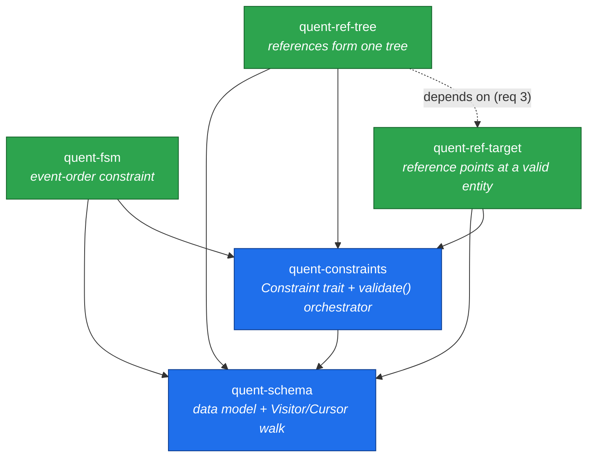

Key takeaways:

- **`quent-schema`** is the foundation. It knows nothing about FSMs, targets, or
  trees.
- **`quent-constraints`** defines *what a constraint is* and *how to run a bunch
  of them in one pass*.
- **`quent-fsm`, `quent-ref-target`, `quent-ref-tree`** are sibling constraint
  crates. They are peers — except `ref-tree` additionally **builds on**
  `ref-target` (a tree-forming reference is *required* to also be
  target-constrained).

---

## 2. `quent-schema` — the data model being validated

A `Schema` is a tree of plain data. Constraints are attached as opaque
`Annotations` (named `Constraint` blobs) on almost any element.

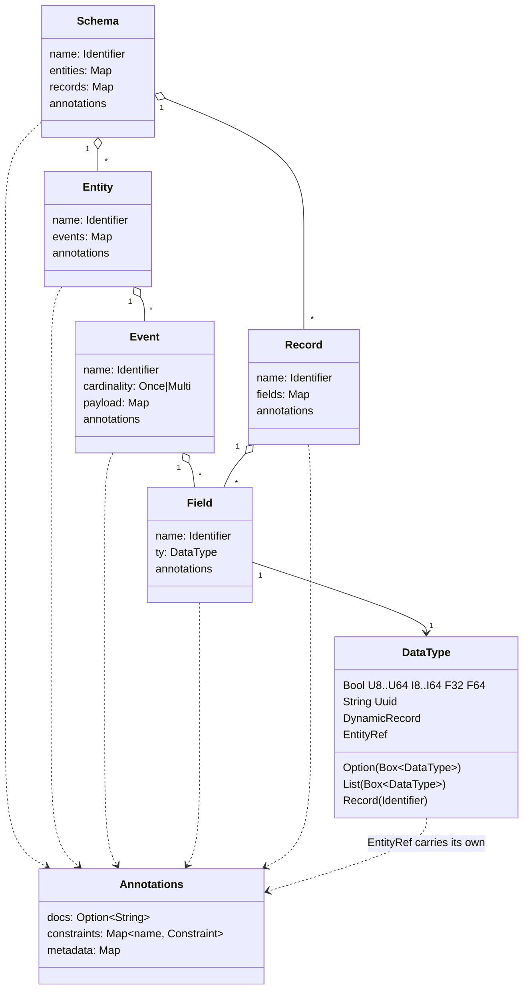

The two `DataType` variants that matter most here:

- **`EntityRef { data, annotations }`** — a reference to *some* entity. On its
  own it is "type-erased": it does not say *which* entity type it points to.
  Constraints in its `annotations` are what give it meaning.
- **`Record(Identifier)`** — a named reference to a top-level `Record`. Records
  are visited once from `Schema::records`, so a `Record(name)` field is a
  pointer, not an inline expansion.

### The Visitor walk

`Schema::walk(visitor)` performs a depth-first traversal, calling
`visitor.visit(&cursor)` on every element *before* its children. The `Cursor`
is the full path from the schema root to the current element — that is how a
constraint knows *where* it is (e.g. "this EntityRef is inside Event X of
Entity Y").

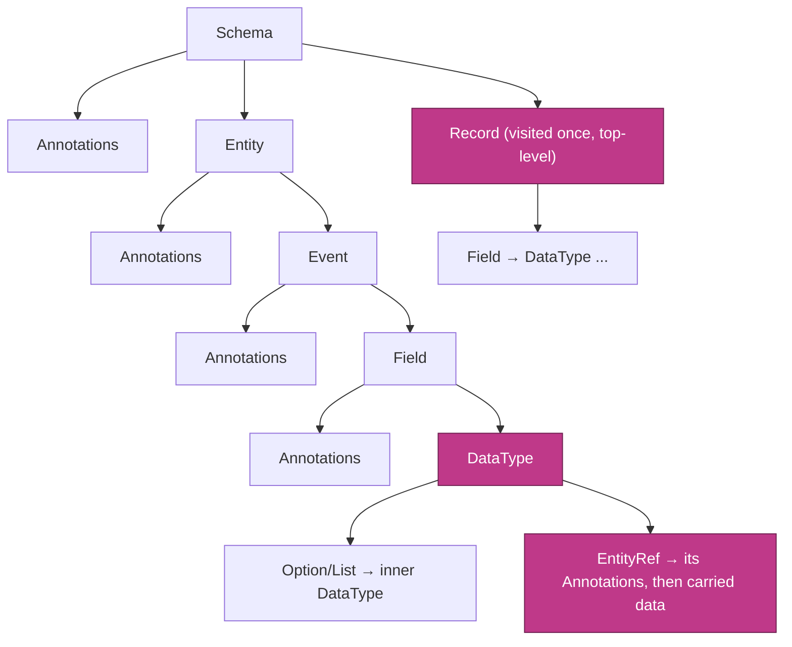

> Important nuance the `ref-tree` algorithm relies on: a `Record` referenced by
> a field is **not** descended into at the field site. The walker visits each
> top-level `Record` exactly once. So to "follow" a record from an event, a
> constraint must build its own graph linking `Event → Record(name)` and then
> `Record → its parent`. (This is exactly what `ref-tree` does — and also where
> the open review finding lives.)

---

## 3. `quent-constraints` — the contract and the orchestrator

Two tiny pieces:

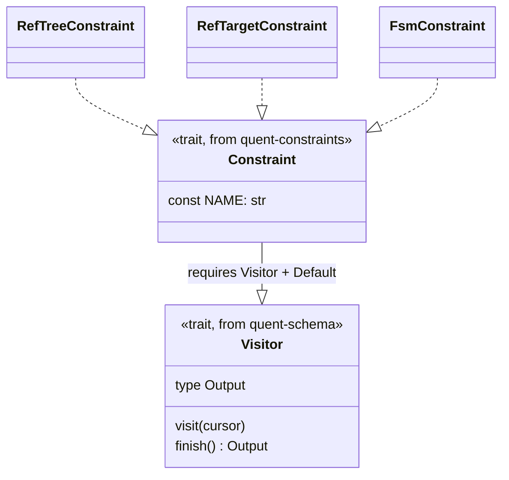

- A **`Constraint`** is "a `Visitor` that also has a unique `NAME`". The `NAME`
  is the key used in a schema's annotations (`"quent.ref-tree.v1"`,
  `"quent.fsm.v1"`, ...).
- **`validate::<(A, B, C)>(schema)`** runs *all* constraints — plus two built-in
  checks — in **a single walk**, then hands back a `Report` with each
  constraint's `Output` in tuple order.

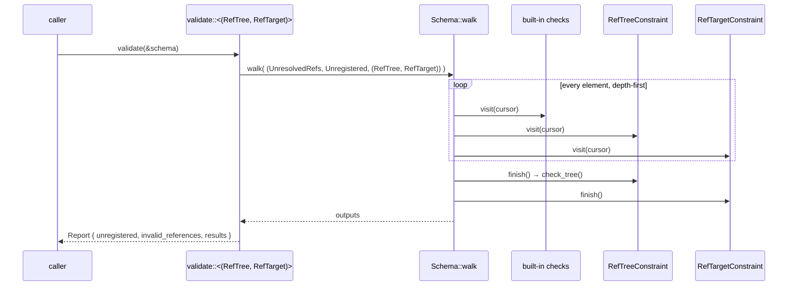

The two always-on built-ins:

- **`UnresolvedReferences`** — every `Record(name)` resolves to a real
  top-level record.
- **`UnregisteredConstraints`** — collects any constraint names present in the
  schema that you did *not* pass to `validate` (so nothing silently goes
  unchecked).

This "all constraints share one walk" design is why each constraint is a
`Visitor`: the orchestrator composes them into a tuple visitor and walks once.

---

## 4. `quent-ref-target` — the prerequisite constraint

`ref-target` answers a narrow question: **"this `EntityRef` claims to point at
entity `T` — does `T` actually exist in the schema?"**

- The target is stored as opaque constraint data: the JSON of an `Identifier`
  (e.g. `"Cluster"`), under the name `quent.ref-target.v1`.
- `RefTarget::from_annotations(...)` is the helper `ref-tree` reuses to read
  that target back out.

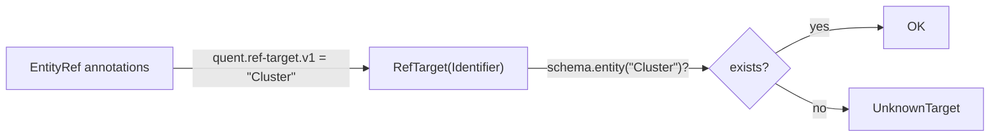

This is the foundation tree-forming references stand on: you cannot build a
*typed* tree out of references that don't even name a valid entity type.

---

## 5. `quent-ref-tree` — the main event

### What it guarantees

> The entity references annotated as *tree-forming* must, together, describe a
> **single tree that connects every entity, rooted at exactly one entity.**

The canonical use is a "preferred parent" link: a way to walk from any entity
back to one root (hierarchical "is owned by / is part of" or causal "is spawned
by" relations).

Its five requirements (from the crate docs):

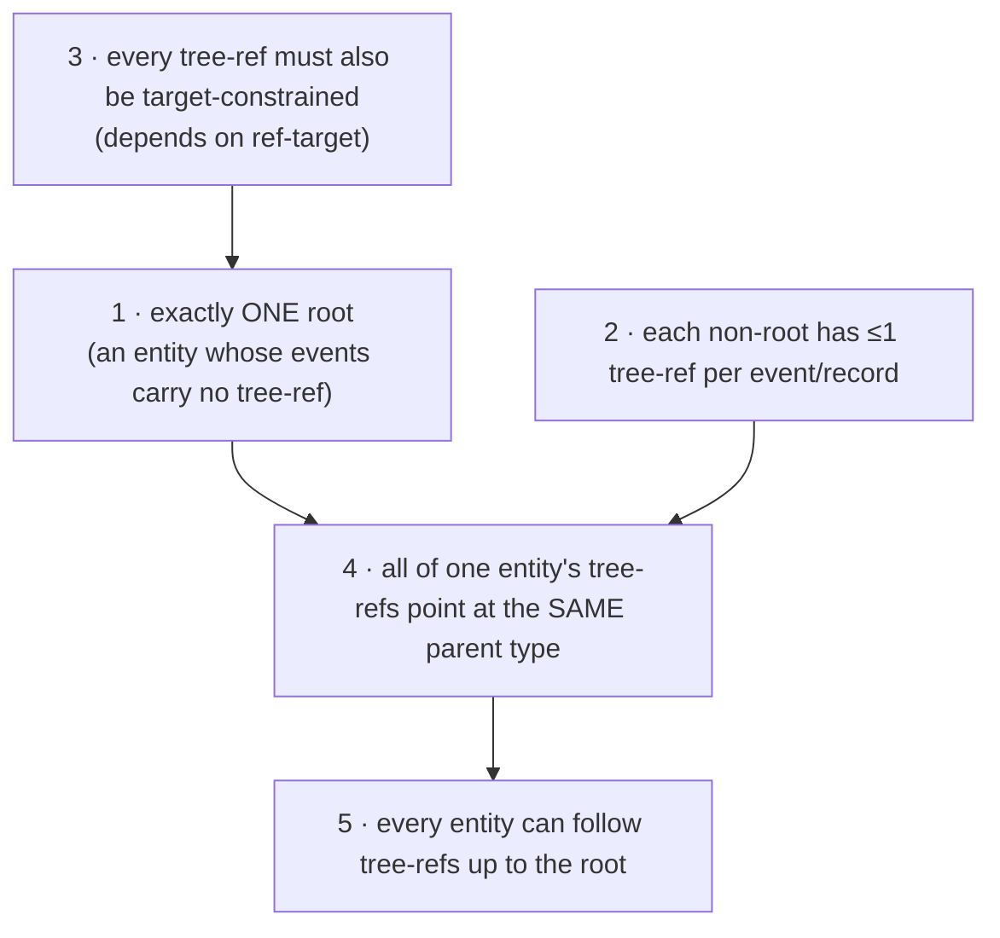

### How it works internally

Because records break the walk (section 2), `ref-tree` can't just read parents
off the cursor. Instead, during the walk it **builds its own directed graph**
with three kinds of nodes, then collapses it in `finish()`.

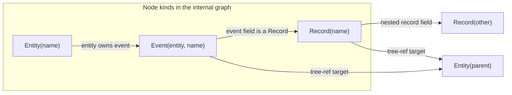

Edges are added on three kinds of `visit` events:

| When the walker sees…                         | …it adds the edge                         |
| --------------------------------------------- | ----------------------------------------- |
| an `Event` under an `Entity`                  | `Entity ──▶ Event`                        |
| a `Record(name)` field (in an event/record)   | `Event ──▶ Record` or `Record ──▶ Record` |
| a tree-forming `EntityRef` (target = `P`)     | `Event ──▶ Entity(P)` / `Record ──▶ Entity(P)` |

Then `finish()` runs the collapse + validation:

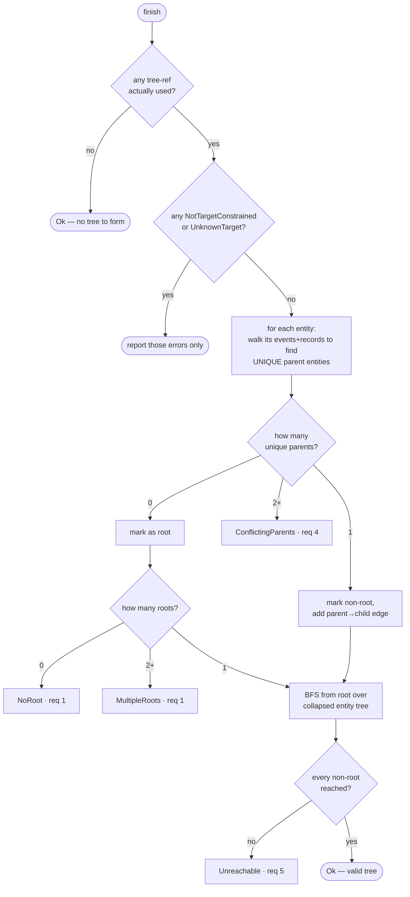

The `entity_unique_parents` helper is the clever bit: from an `Entity` node it
does a DFS through that entity's `Event` and `Record` nodes (with a `seen` set
so self-referential records don't loop), and collects every `Entity` node it
can reach. Those are the entity's candidate parents.

- **0 parents** → root candidate.
- **exactly 1** → a normal child; contributes one edge to the collapsed tree.
- **2+ distinct** → `ConflictingParents` (req 4 violated).

Finally it BFS-walks the collapsed `parent → child` tree from the unique root;
any entity not reached is `Unreachable` (e.g. a cycle that never touches the
root).

### The error taxonomy

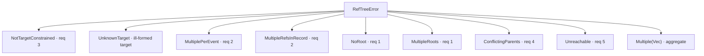

---

## 6. Relationship to `quent-fsm` (a sibling constraint)

`fsm` and `ref-tree` never talk to each other, but they are *structurally
identical* and often describe the same schema from different angles:

| Aspect              | `quent-fsm`                                  | `quent-ref-tree`                                  |
| ------------------- | -------------------------------------------- | ------------------------------------------------- |
| Constrains          | the **order of one entity's events** in time | the **parent links between entities**             |
| Annotation lives on | the **`Entity`** (FSM topology JSON)         | the **`EntityRef`** (a marker + target)           |
| Internal model      | a state graph per entity (petgraph)          | one entity/event/record graph for the whole schema |
| Built-in helpers    | `Bfs`, `tarjan_scc` for reachability/cycles  | `Bfs` for root-reachability                       |
| Output              | `Result<(), FsmError>`                       | `Result<(), RefTreeError>`                        |

Both are just `Visitor + Constraint`, so you can validate them together:

```rust
let report = validate::<(FsmConstraint, RefTreeConstraint, RefTargetConstraint)>(&schema);
```

Think of it as: **FSM = how one entity evolves over time; ref-tree = how
entities are organized in space (the ownership hierarchy).**

---

## 7. A real-world example: observing a Kubernetes-style platform

Imagine instrumenting a container platform. The natural ownership hierarchy is
a textbook tree:

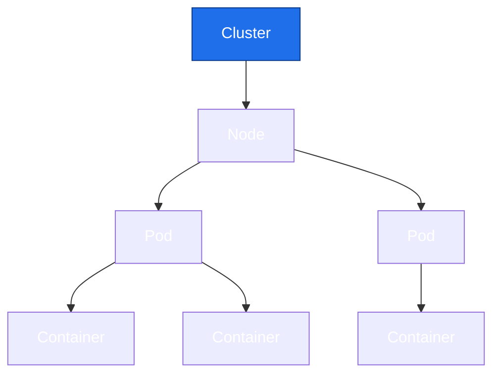

- `Cluster` is the **root** — it is the entry point, owned by nothing.
- `Node` *is part of* a `Cluster`.
- `Pod` *is scheduled on* a `Node`.
- `Container` *is part of* a `Pod`.

Each non-root entity emits an event that carries a **tree-forming reference**
to its parent. That reference is both `quent.ref-tree.v1` (marker) and
`quent.ref-target.v1` (which parent type).

### Modeling it with the builder API

```rust
use quent_constraints::{Constraint, validate};
use quent_ref_target::RefTargetConstraint;
use quent_ref_tree::{RefTreeConstraint, RefTreeError};
use quent_schema::{
    Cardinality, DataType, Identifier,
    builder::{AnnotationsBuilder, EntityBuilder, EventBuilder, SchemaBuilder},
};

fn id(s: &str) -> Identifier {
    Identifier::try_new(s).unwrap()
}

/// An `EntityRef` that is BOTH tree-forming and target-constrained to `parent`.
/// This is the "my parent is one specific entity type" link.
fn parent_ref(parent: &str) -> DataType {
    // ref-target data is just the JSON of the target identifier, e.g. "Node".
    let target = serde_json::to_string(&id(parent)).unwrap();
    DataType::EntityRef {
        data: None,
        annotations: AnnotationsBuilder::new()
            .constraint(RefTreeConstraint::NAME, None)
            .unwrap()
            .constraint(RefTargetConstraint::NAME, Some(target))
            .unwrap()
            .build(),
    }
}

/// A field whose value carries a parent reference.
fn parent_field(name: &str, parent: &str) -> quent_schema::Field {
    quent_schema::Field::new(id(name), parent_ref(parent), Default::default())
}

fn build_platform_schema() -> quent_schema::Schema {
    // Root: a Cluster. Its events carry NO tree-forming reference.
    let cluster = EntityBuilder::new(id("Cluster"))
        .event(
            EventBuilder::new(id("provisioned"), Cardinality::Once)
                .build(),
        )
        .unwrap()
        .build();

    // Node: "is part of" a Cluster.
    let node = EntityBuilder::new(id("Node"))
        .event(
            EventBuilder::new(id("joined"), Cardinality::Once)
                .field(parent_field("cluster", "Cluster"))
                .unwrap()
                .build(),
        )
        .unwrap()
        .build();

    // Pod: "is scheduled on" a Node. It can be rescheduled, but always onto the
    // same *type* of parent (Node), so req 4 holds even across events.
    let pod = EntityBuilder::new(id("Pod"))
        .event(
            EventBuilder::new(id("scheduled"), Cardinality::Once)
                .field(parent_field("node", "Node"))
                .unwrap()
                .build(),
        )
        .unwrap()
        .build();

    // Container: "is part of" a Pod.
    let container = EntityBuilder::new(id("Container"))
        .event(
            EventBuilder::new(id("started"), Cardinality::Once)
                .field(parent_field("pod", "Pod"))
                .unwrap()
                .build(),
        )
        .unwrap()
        .build();

    SchemaBuilder::new(id("K8sPlatform"))
        .entities([cluster, node, pod, container])
        .unwrap()
        .build()
}

fn main() {
    let schema = build_platform_schema();

    // Validate the tree constraint together with its prerequisite.
    let report = validate::<(RefTreeConstraint, RefTargetConstraint)>(&schema);

    match report.results.0 {
        Ok(()) => println!("✅ references form a valid tree rooted at Cluster"),
        Err(RefTreeError::Multiple(errs)) => {
            eprintln!("❌ {} tree violations:", errs.len());
            for e in errs {
                eprintln!("  - {e}");
            }
        }
        Err(e) => eprintln!("❌ tree violation: {e}"),
    }
}
```

### What the constraint sees internally

For the schema above, `ref-tree` builds this graph during the walk…

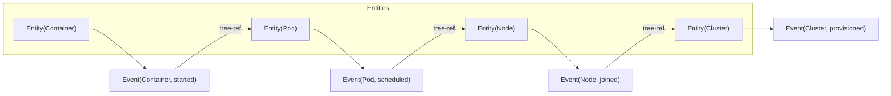

…and `finish()` collapses it to the clean tree (one root, everyone reaches it):

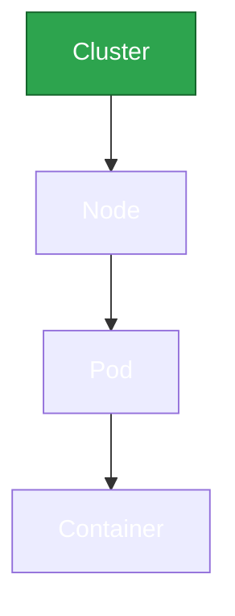

### How it would fail (mapping back to requirements)

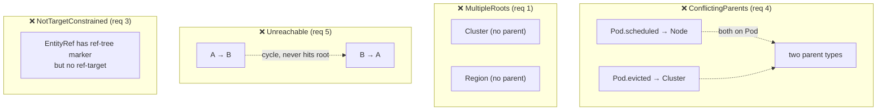

- Give `Pod` two events pointing at different parent **types** → `ConflictingParents`.
- Add a second entity with no parent link → `MultipleRoots`.
- Make `A → B` and `B → A` with neither reaching `Cluster` → two `Unreachable`.
- Mark a reference tree-forming but forget the target → `NotTargetConstrained`.

---

## 8. Why this architecture is nice

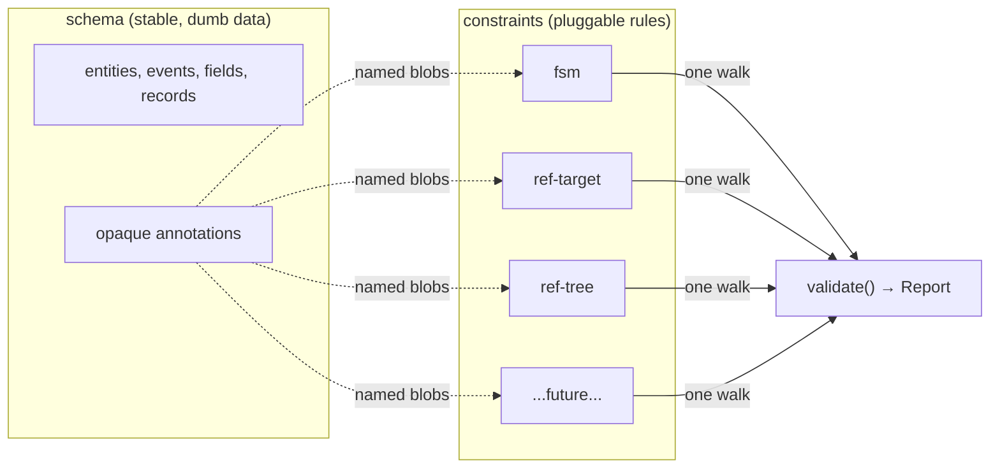

- **Separation of concerns** — the schema never learns domain rules; new
  constraints ship as new crates without touching `quent-schema`.
- **Forward compatibility** — an unknown constraint is *reported*
  (`UnregisteredConstraints`), never silently ignored, and codegen can still
  emit a working API even before it understands a new constraint.
- **Single-pass efficiency** — `validate::<(A, B, C)>` composes visitors into a
  tuple and walks the schema once.
- **Composability** — `ref-tree` reusing `ref-target` shows constraints can
  layer on each other instead of duplicating logic.

---

## 9. One-paragraph summary

`quent-schema` gives you a minimal, serializable model of entities/events/records
plus a `Visitor` walk. `quent-constraints` defines the `Constraint` trait (a
named `Visitor`) and a `validate()` orchestrator that runs many constraints in a
single walk and returns a `Report`. `quent-ref-target`, `quent-fsm`, and the new
`quent-ref-tree` are independent constraint crates that implement `Visitor +
Constraint`. `quent-ref-tree` marks certain entity references as "tree-forming",
builds an internal entity/event/record graph as it walks, and in `finish()`
collapses that graph to verify the references describe exactly one
root-connected tree — reusing `quent-ref-target` to guarantee every such
reference names a real parent entity.
